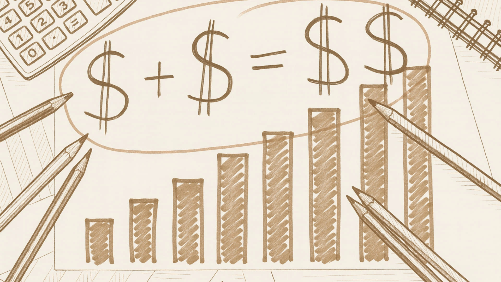

# Head Editor

**id**: free-cash-flow
**title**: How do you read 'Free Cash Flow' ? Why seeing a negative number sometimes isn't a bad thing. 
**description**: If you're serious about value investing, you’ve got to get a handle on Free Cash Flow (FCF). We’re breaking it down with simple examples to show you how FCF stacks up against net income. Once you understand what free cash flow really tells you, you’ll be able to see the real truth behind a company’s financial health. 
**keywords**: Free Cash Flow, FCF, what is free cash flow, calculating FCF, FCF vs net income, negative free cash flow, Buffett on FCF, cash flow statement, value investing, financial analysis. 
**list-summary**: How should you read this one? A negative number isn't always a bad thing. In some cases, it's actually acceptable.
**name**: Free Cash Flow

---

# Hero Editor

	

		

			<h1>How do you read 'Free Cash Flow' ? Why seeing a negative number sometimes isn't a bad thing.</h1>
			
Does a negative free cash flow mean the company is about to go under? Not necessarily. There are "good" negatives and "bad" negatives. A good negative number could be the key to a company's rise, while a bad one is a warning sign of collapse. We can use a simple table to figure out if the company is "investing in its future" or just "bleeding cash to survive."

		

	

	

---

# Content Editor

	

		
Picture this. It is Saturday night, and the restaurant is packed. When you close up shop, the register is stuffed with cash (quick reminder, we call it <strong>Revenue</strong>). Business is on fire. And the best part? It is your restaurant. Nice work!

		
Business stays hot like that for pretty much the whole month. Finally, you make it to the end of the month, and you are excited to tally up your profits. You deduct the costs for top-tier ingredients, rent, salaries, and new equipment. But after doing all the math, you realize something weird. Your "Net Profit" and the "Cash Left Over" do not match up.

		
That is actually how financial reports work in the real world. Many "expenses" get deducted from your profit even if they didn't cost you a single dime of actual cash (like equipment depreciation). Or maybe your revenue looks amazing on paper, but you haven't actually collected any cash yet (like stuffing the channel with inventory). A lot of companies look profitable but are actually super tight on cash. That is why Warren Buffett focuses so heavily on "Free Cash Flow." You just cannot fake the numbers on that report.

	

	

		<h2>Why is "Free Cash Flow" More Honest Than "Net Income"?</h2>
		
"Net Income" on the Income Statement is like a carefully photoshopped picture with full makeup. It is the company showing you their absolute best side. Accountants can use legal rules to make those numbers look way prettier than they actually are.

		
On the other hand, "Free Cash Flow" on the Cash Flow Statement is like an unfiltered medical report. You get the raw truth. Cash in is cash in, and cash out is cash out. It is almost impossible to fake.

		<h3 class="inside">A Real Comparison Between "Free Cash Flow" and "Net Income"</h3>
		
Below are a simplified Income Statement and Cash Flow Statement. I have included a few key items as examples.

		
Looking at this simple table, you can see that the two sides are connected, but the final numbers don't match. Some items get subtracted on the Income Statement but have to be added back on the Cash Flow Statement. That is because the logic is different. The Income Statement tracks "performance," while the Cash Flow Statement tracks "actual cash collected." Value investors use this to find companies that have both "growth momentum" and "real money coming in the door."

		

			<h3 class="inside">Simplified Income Statement</h3>
			

				

					

						

							

								
<i class="bi-caret-right-fill"></i> <strong>Revenues</strong>

							

							

								
$1,000,000

							

						

					

				

				

					

						

							

								
<i class="bi-caret-right-fill"></i> <strong>Gross Profit</strong>

							

							

								
$700,000

							

						

					

				

				

					

						

							

								
<i class="bi-caret-right-fill"></i> <strong>Operating Income</strong>

							

							

								
$300,000

							

						

					

				

				

					

						

							

								
<i class="bi-caret-right-fill"></i> <strong>Net Income</strong>

							

							

								
$250,000

							

						

					

				

			

		

		<ul>
			<li><strong>Revenues</strong>: The sales performance earned during this period. But remember, some of this might be inventory that is just sitting there and hasn't actually been sold yet.</li>
			<li><strong>Gross Profit</strong>: Subtract the cost of ingredients to calculate the Gross Profit.</li>
			<li><strong>Operating Income</strong>: Subtract rent, staff salaries, and equipment depreciation to calculate the Operating Income.</li>
			<li><strong>Net Income</strong>: Then deduct any non-operating income or expenses to finally arrive at your Net Income number.</li>
		</ul>
		

			<h3 class="inside">Simplified Cash Flow Statement</h3>
			

				

					

						

							

								
<i class="bi-caret-right-fill"></i> <strong>Net Income</strong>

							

							

								
$250,000

							

						

					

				

				

					

						

							

								
<i class="bi-caret-right-fill"></i> <strong>Equipment Depreciation</strong>

							

							

								
+$80,000

							

						

					

				

				

					

						

							

								
<i class="bi-caret-right-fill"></i> <strong>Inventory</strong>

							

							

								
-$100,000

							

						

					

				

				

					

						

							

								
<i class="bi-caret-right-fill"></i> <strong>Buying Equipment</strong>

							

							

								
-$65,000

							

						

					

				

				

				

					

						

							

								
<i class="bi-caret-right-fill"></i> <strong>Free Cash Flow</strong>

							

							

								
$165,000

							

						

					

				

			

		

		<ul>
			<li><strong>Net Income</strong>: We start the Cash Flow calculation using the Net Income figure from the Income Statement.</li>
			<li><strong>Equipment Depreciation</strong>: Depreciation on the Income Statement is just an accounting rule for writing off value over time. You didn't actually pay cash for the equipment during this specific period since that bill was paid ages ago. So you have to add that amount back in on the Cash Flow Statement.</li>
			<li><strong>Inventory</strong>: On the Income Statement, increasing inventory might count toward business activity, but inventory means you haven't actually sold it to get the cash yet. So we have to subtract that amount on the Cash Flow Statement.</li>
			<li><strong>Buying Equipment</strong>: On the Income Statement, the cost of buying equipment is deducted slowly over time as "depreciation." But on the Cash Flow Statement, it counts as a "one-time expense" right when you buy it. That causes a gap between the two calculations.</li>
			<li><strong>Free Cash Flow</strong>: The final result you get after taking that starting Net Income and adding or subtracting each item down the list.</li>
		</ul>
	

	

		<h2>Does Negative Free Cash Flow Mean the Company is About to Go Under?</h2>
		
It is actually a lot like cholesterol. Hearing your levels are high sounds scary at first, but you can actually split it into "good cholesterol" and "bad cholesterol." When you see a company with negative free cash flow, you need to tell if it is a "good negative" or a "bad negative." Learn to read the root cause of that negative number just like a senior analyst.

		<h3 class="inside">A Good Negative Means Investing in the Future</h3>
		
A "good negative" is usually a huge strategic investment focused on the future. The core business is making money and bringing in cash nonstop. But management decides to take that money, plus some savings and bank loans, and put it all into a project that will generate even more revenue (like a new factory or production line). At that moment, the total money going out is higher than the money coming in, so free cash flow turns negative.

		
Is this negative number scary? No. It is not a crisis. It is proof of ambition. It means the company is planting seeds for massive success tomorrow. It is investing in the future. Amazon in the early days is the classic example. For a long time, it poured all its cash into building warehouses and R&D. This caused its free cash flow to often be negative, but that is how it built an unbeatable e-commerce empire.

		
However, if it stays negative for several accounting periods in a row (like multiple quarters or years) because of this, you have to watch out and make sure they aren't gambling too hard.

		<h3 class="inside">A Bad Negative Is a Warning Sign of Bleeding Cash</h3>
		
A "bad negative" is much more dangerous. The root cause isn't investing in the future. It is that the core business itself can't generate positive cash flow. This means the company is burning money just trying to keep the lights on (selling products and paying bills). There is zero extra cash to even talk about investing in the future.

		
This kind of negative number is a huge red flag. It means the business model might be broken, and the core business is bleeding out. If this keeps up, the company will have to keep borrowing money or asking shareholders for cash just to stay alive. That is a hard road to sustain for long.

	

	

		<h2>Think About What the Free Cash Flow Numbers Really Mean</h2>
		
Don't just follow what the tutorials say by plugging numbers into formulas or checking boxes. You need to look at this like you are truly analyzing a business. Think about what each number implies and how it will shape the future. Treat yourself like a real partner in the business.

		
As a partner, you stop caring only about the sales figures on the Income Statement or even just the numbers on the Cash Flow Statement. You have to use these financial reports to judge whether this company is making the right moves for your investment!

	

