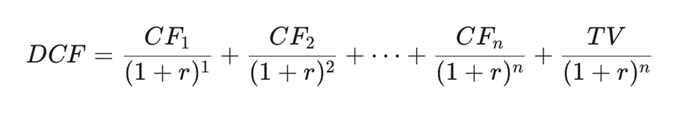

# Head Editor

**id**: discounted-cash-flow
**title**: Discounted Cash Flow (DCF) : Look at the cash actually earned. This helps you value the company from a real business perspective.
**description**: Think the DCF formula is way too complicated? We’re breaking it down with a simple 'buying a coffee shop' story to walk you through a full discounted cash flow valuation. We’ll cover everything from free cash flow and discount rates to terminal value. Learn how to think about valuation like Warren Buffett and stop stressing over market swings.
**keywords**: Discounted Cash Flow, DCF, DCF valuation, DCF formula, Free Cash Flow, FCF calculation, discount rate, discount rate calculation, DCF tutorial, terminal value, value investing, business valuation.
**list-summary**: It's all about the actual cash the business generates. This method helps you value a company from an owner's point of view, not just as a stock.
**name**: DCF

---

# Hero Editor

	

		

			<h1>Discounted Cash Flow (DCF) : Look at the cash actually earned. This helps you value the company from a real business perspective.</h1>
			
The "Cash Yield Valuation Method" is pretty interesting. This formula basically stems from Warren Buffett's love for cash. He believes a company's value is largely decided by "how much cash it can actually rake in." To him, earning real cash is the only corporate profit that truly matters.

			
Of course, you can't just look at this year's numbers. You have to look five or ten years down the road. That is why Buffett created a formula to estimate how much money a company will make in the future. He adjusts for inflation and then works backward to calculate its present value today. That tells us exactly how much "future value" we are buying right now.

		

	

	

---

# Content Editor

	

		
Ever wonder what really drives stock prices?

		
We get bombarded every day with financial news, analyst reports, and dizzying stats like P/E and P/B ratios. After a while, you might feel like you’re getting the hang of it, but once you dig a little deeper, you realize you actually don't know much at all.

		
We all know we’re supposed to "buy low," but what counts as "low"? We also know not to "chase the highs," but how high is too high? Let's cut out the noise and go back to square one. Forget those complicated charts and metrics for a second. We need to get to the root of how you actually measure a company's true worth.

		
The whole point of running a business is to make money. To be more precise, it's about making cash. So, when we try to figure out a company's valuation, we need to look at how much cash it will generate in the future. That is the core of real value. In finance, this approach is called "Discounted Cash Flow," or simply DCF.

	

	

		<h2>1. Free cash flow: how much cash does this business make me every year?</h2>
		
Imagine you’re an entrepreneur walking into a coffee shop you’re thinking about buying. When you're sizing up its value, you probably aren't asking, "Hey, what’s the P/E ratio here?" No, you are focusing on the most fundamental question: "After paying all the expenses, how much actual cash is this place going to generate for me every year?"

		
The owner pulls out the financial statements, points to "Net Profit," and says, "Look, we made 500k last year. Not bad, right?" The number looks great on paper. But you’re a savvy buyer, so you don’t just nod along. You know that profit on paper and money in your pocket are two completely different things.

		<h3 class="inside">Why look at free cash flow instead of net profit?</h3>
		
Net profit is just an accounting concept, and sometimes it can be deceptive—or at least misleading. Free cash flow, on the other hand, is the actual cash the business is churning out.

		
As I’ve mentioned before, when you switch from looking at the income statement to looking at free cash flow, you’ll notice some "missing cash" and some "extra cash." There’s always a gap between the two. That gap is exactly where people try to play tricks with the numbers.

		<ol>
			<li><strong>The missing cash (capital expenditures)</strong>: You might need to drop 200k on a new espresso machine next year. That 200k is a "capital expenditure," so it won't be fully deducted from the income statement right away (thanks to depreciation). However, that is real cash leaving your wallet.</li>
			<li><strong>The extra cash (depreciation)</strong>: At the same time, that 500k profit figure includes a 50k deduction for "equipment depreciation" calculated by the accountant. That’s just spreading out the cost of an old machine bought three years ago. You didn't actually pay that cash out this year.</li>
		</ol>
		
Thinking like a business owner, you need to calculate the money that actually lands in your pocket, not just the "performance on paper." Paper performance is mostly just for show to investors. The Discounted Cash Flow method is basically how Warren Buffett thinks about valuation from an owner's perspective. That is why you have to start your evaluation with free cash flow.

	

	

		<h2>2. Discount rate: is 1 million next year worth the same as 1 million today?</h2>
		
By checking the books and looking at future plans, you can roughly figure out how much free cash flow this coffee shop will bring in over the next few years. Let’s say you estimate it will generate a million in cash next year. Before you open your wallet to buy it, you have to ask yourself: "Is a million dollars next year really worth a million dollars to me today?"

		
The "Time Value of Money" is basically common sense in the finance world. Money today is always worth more than money in the future. "Discounting" is just the process of translating that future money into today's value. The rate you use to do that translation is what we call the "discount rate."

		
It’s just like when you watch those TV shows or read history books that talk about a rich person's fortune from back in the day, and then they tell you what it would be worth in today’s dollars. That is basically the same kind of calculation.

		<h3 class="inside">The discount rate is just your minimum requirement for the investment</h3>
		
First off, there is no single "correct" answer for the discount rate. Back in the day, Warren Buffett used the yield on 30-year U.S. Treasury bonds as his benchmark. The logic is that you don't have to put your money into stocks or this specific business. You could just choose to buy those 30-year bonds, which are risk-free and might pay you a steady 8% every year (hypothetically speaking). That is your "opportunity cost."

		
Now let's go back to that coffee shop. Buying it means putting in time and energy, plus you have to deal with all sorts of risks. If you decide to go down that tough road, you definitely need to earn more than that risk-free 8%, right? So, you pick a number higher than 8% as your minimum expected return. Let's say 13%. That becomes your "discount rate," and that is the number you will use for all your calculations moving forward.

		
There is no standard rule for exactly what the rate should be. You can set your own "minimum expected return" based on your own situation and what you demand from the investment.

	

	

		<h2>3. Terminal value: what happens after year five? How do you figure out a shop's long-term worth?</h2>
		
You’ve already figured out the coffee shop’s free cash flow for the next five years, and you’re set on that 13% discount rate. But here is the thing. A good shop worth buying should theoretically run for way longer than five years, maybe even decades. The problem is, trying to predict cash flow ten or twenty years down the road is basically impossible.

		
So, we need to come up with a value that covers everything from year six until forever. Keep in mind, this is just a model based on assumptions, but we still need those assumptions to make the calculation work.

		
Wall Street came up with a fancy term for this called "Terminal Value." Think of it as the fair price you could get if you decided to sell that stable, mature coffee shop after running it for five years.

		
You don’t need to try and guess the revenue for year six, year seven, or year nineteen. The concept is more like this: once the shop settles into a stable groove, another buyer in the market might be willing to pay a multiple of its fifth-year free cash flow to take it off your hands at the end of that year. This is actually a pretty common way of thinking. People often use a multiple of annual rent or profit to estimate value when they are looking at real estate or buying small businesses.

		
Terminal value is the final piece of the puzzle in our DCF formula. It helps us estimate all the potential value of a good company over a predictable timeframe. Usually, we set that "predictable timeframe" at about 20 years.

	

	

		<h2>The complete Discounted Cash Flow formula</h2>
		
We just walked through three ways to think about this business equation.

		
How much cash will this business make down the road? Forecasting future free cash flow.

		
What is that future money worth right now? Deciding on your personal discount rate.

		
How do we size up the value for the long haul? Estimating a reasonable terminal value.

		<h3 class="inside">The Discounted Cash Flow formula model</h3>
		
		
CF = Your estimated "Free Cash Flow" for each future period. For example: 500k in year one, 550k in year two, 600k in year three, 650k in year four, and 700k in year five. We typically project the free cash flow for years one through five. For year six and beyond, we switch to using the terminal value.

		
r = The personal "discount rate" you decided on. Like that 13% we just mentioned.

		
TV = The "terminal value" you estimated. For instance, if you think you could sell the coffee shop at the end of year five for 10 times that year's free cash flow (which is 700k), you would plug in 7 million.

		<h3 class="inside">Doing the actual math</h3>
		
The formula model might look complicated, but don't worry, it's actually pretty simple. Just look back at those three concepts we discussed. Once you turn them into concrete numbers, you just plug them into the formula and do the math.

		<h4 class="inside">1. First, calculate the present value for the first five years</h4>
		
Year 1 PV: 50 ÷ (1+0.13)¹ = 44.25

		
Year 2 PV: 55 ÷ (1+0.13)² = 43.08

		
Year 3 PV: 60 ÷ (1+0.13)³ = 41.58

		
Year 4 PV: 65 ÷ (1+0.13)⁴ = 39.86

		
Year 5 PV: 70 ÷ (1+0.13)⁵ = 37.99

		<h4 class="inside">2. Next, calculate the discounted terminal value</h4>
		
PV of terminal value: 700 ÷ (1+0.13)⁵ = 379.94

		<h4 class="inside">3. Add everything up</h4>
		
Intrinsic value of the coffee shop = 44.25 + 43.08 + 41.58 + 39.86 + 37.99 + 379.94 = 586.7

		
Based on your estimates and requirements, the "intrinsic value" of this coffee shop comes out to about 5.87 million (since the units in the calculation were in ten-thousands). That figure serves as your benchmark for the purchase price.

		
The same logic applies to the stock market. Once you calculate the intrinsic value using the Discounted Cash Flow method, you can use that amount as your reference point for buying and selling.

	

	

		<h2>Using cash flow to figure out value</h2>
		
Keep this in mind! Since the DCF model (and honestly, any valuation model) is trying to predict the future, every parameter inside it is just an assumption. There is no such thing as 100% accuracy here. If you change even one assumption slightly, the final number is going to shift.

		
The most valuable part of calculating this isn't the number itself, but the process. It forces you to think about the actual business operations. That way, when the stock price acts up, you can stay cool and ask yourself: "Is the price just fluctuating, or is the company's long-term ability to make money actually declining?"

		
Oh, and one more thing. The DCF method is best suited for calculating the intrinsic value of companies that are relatively stable and predictable. That is because you have to forecast cash flows for several years into the future.

	

