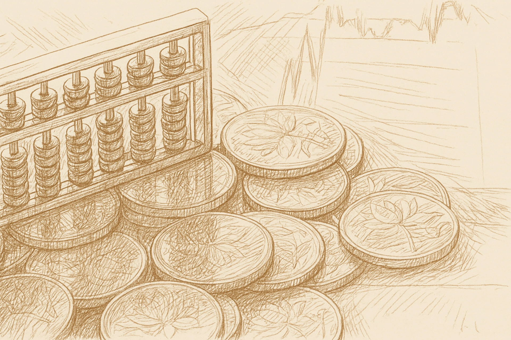

# Head Editor

**id**: dividend-yield-valuation
**title**: Dividend Yield Valuation : Use these 3 steps to work backward and find the intrinsic value.
**description**: Want to learn how to work backwards from dividend yield to find the fair value of stable income stocks? We’ve put together a full guide that walks you through a simple 3-step calculation. Plus, we’ll share three big warning signs to watch out for so you don't fall into a 'value trap' where you lose more in share price than you gain in dividends. Start building a cash flow you can actually count on.
**keywords**: Dividend yield valuation, calculating fair value for dividend stocks, avoiding the dividend trap, stable dividend stocks, dividend yield, dividends, share price, fair value, value trap, income stocks.
**list-summary**: It's a 3-step way to 'work backward' and figure out its intrinsic value.
**name**: Dividend Yield Valuation

---

# Hero Editor

	

		

			<h1>Dividend Yield Valuation : Use these 3 steps to work backward and find the intrinsic value.</h1>
			
Everyone looks at a company's value from a slightly different angle. There is a specific group of folks who buy stocks strictly for those steady cash dividends. For them, using the dividend yield to work backward and find a fair stock price makes perfect sense.

		

	

	

---

# Content Editor

	

		
This "Dividend Yield Valuation" method is perfect for long-term investors looking for consistent cash flow. Using the yield to estimate value is a pretty simple and reliable formula. We’ll take you through the whole model, from the basic concept to the actual math steps, and show you how to use it to plan your own portfolio strategy.

		
In a way, you could say it helps you spot a fair price amidst all the market chaos. The best part is that you don't need to overthink it. You basically just stick to the yield to figure out what a reasonable price looks like.

	

	

		<h2>What is the dividend yield valuation method? A favorite for long-term investors</h2>
		
Like I mentioned earlier, this method uses the dividend yield to work backward and figure out a fair stock price. It is perfect for those "buy-and-hold" investors who are looking for a steady stream of cash.

		<h3 class="inside">A simple way to use yield to figure out the stock price</h3>
		

			

				
Target Price = Annual Cash Dividend ÷ Expected Dividend Yield %

			

		

		
We've talked about "dividend yield" before. It basically tells you what percentage return you get annually in dividends based on the price you pay today. This valuation method just flips that equation around. With some simple algebra, you can work backward to find your target stock price.

		
The logic here is super intuitive. First, you decide on the "annual return" (dividend yield) you want. Next, you estimate the cash dividend the company is likely to pay out next year. From there, you can calculate the maximum price you should be willing to pay for those dividends. Basically, you are paying today's price to lock in a steady stream of cash for the future.

	

	

		<h2>Using dividend yield to find a fair price</h2>
		
Just follow these three steps to figure out a reasonable price.

		<h3 class="inside">Step 1: estimate future cash dividends</h3>
		

			

				
Estimated Cash Dividend = Estimated Full-Year EPS × Average Payout Ratio

			

		

		
Pay attention here. We are using estimates for the future, not known numbers from the past, because investing is all about future returns.

		
While we can't predict the future perfectly, we can make a smart calculation by looking at two key stats: "Estimated EPS" and the "Past Average Payout Ratio."

		
Let's say Company A has had an average payout ratio of about 70% over the last seven years. Market analysts predict the company’s EPS will be $3 next year. So, we can expect a potential cash dividend of: $3 × 70% = $2.10.

		
For companies with extremely stable profits and dividend policies, like Chunghwa Telecom (2412), many investors simply use the most recent year's dividend as their estimate. That is also a valid, simplified way to do it.

		<h3 class="inside">Step 2: set your expected yield</h3>
		
This is totally personalized. It represents the percentage of cash return you personally want to get from this investment every year.

		
To make the valuation more flexible, we usually don't just pick one number. Instead, we set a price range to define how attractive the investment is. You can use these standards to set your own targets:

		
You will understand exactly what this means when we calculate the full formula in the next step.

		<ol>
			<li><strong>Cheap price</strong>: Target yield 7%. This means you are looking for a higher return, so you are only willing to buy when the stock price is cheap enough.</li>
			<li><strong>Fair price</strong>: Target yield 5%. This is a yield that matches the market average. This would be considered a fair, reasonable price.</li>
			<li><strong>Expensive price</strong>: Target yield 3%. This means the stock price is already pretty high, so the return isn't as attractive anymore.</li>
		</ol>
		<h3 class="inside">Step 3: plug the numbers into the formula for three price points</h3>
		

			

				
Target Price = Annual Cash Dividend ÷ Expected Yield %

			

		

		
Once you have your "Estimated Dividend" and your "Expected Yield" ready, just plug them into the formula to get the three corresponding prices.

		
Sticking with the example of Company A, let's assume the estimated annual dividend is $2.10. If we use expected yields of 7%, 5%, and 3%, the price points look like this:

		<ol>
			<li><strong>Cheap</strong>: 2.1 ÷ 7% = 30</li>
			<li><strong>Fair</strong>: 2.1 ÷ 5% = 42</li>
			<li><strong>Expensive</strong>: 2.1 ÷ 3% = 70</li>
		</ol>
		
The higher you set your expected yield, the lower the calculated price will be. Looking at this example, if you want at least a 7% dividend return, buying at anything under $30 would be a smart move for you.

	

	

		<h2>Avoid the hidden trap of chasing dividends and losing value</h2>
		
When you see a juicy high yield number, take a breath before you dive in. Ask yourself these three questions first. They will help you steer clear of most investment traps.

		<h3 class="inside">Red flag 1: is the yield only high because the stock price tanked?</h3>
		
This is the classic "value trap." A high yield usually happens for one of two reasons: either the company is paying out fat dividends, or the stock price has fallen off a cliff. That second one is a major warning sign.

		
Even if the dividend payout hasn't changed, a crashing stock price will automatically push the yield up, making the stock look super "cheap." If that number lures you in and you think you found a gem, be careful. You might just be catching a falling knife.

		<h3 class="inside">Red flag 2: is the money coming from profits or loans?</h3>
		
A healthy, sustainable cash dividend has to come from real profits the company actually earned. If a company is paying out more cash than it’s bringing in, that is a massive danger signal.

		
It means that extra money isn't coming from this year's earnings. Instead, they are digging into their own capital. Some companies will even sell off assets or issue new stock just to make their dividend look pretty and create the illusion of stability. Investors need to be extremely careful with this.

		<h3 class="inside">Red flag 3: is this a one-time thing or a steady payout?</h3>
		
The dividend yield valuation method relies on one core assumption: that future dividends will keep flowing steadily. This works great for mature companies with stable profits. But if you try to use this formula on cyclical stocks, you could end up making a serious mistake.

	

	

		<h2>Thinking in terms of cash dividends</h2>
		
Now you’ve got the hang of calculating value using the dividend yield method. It gives you another tool to work with.

		
Remember Charlie Munger’s famous philosophy: it is far better to buy a wonderful company at a fair price than to buy a mediocre company at a cheap price. When your strategy revolves around cash dividends, this method helps you figure out the fair price for any stock.

	

