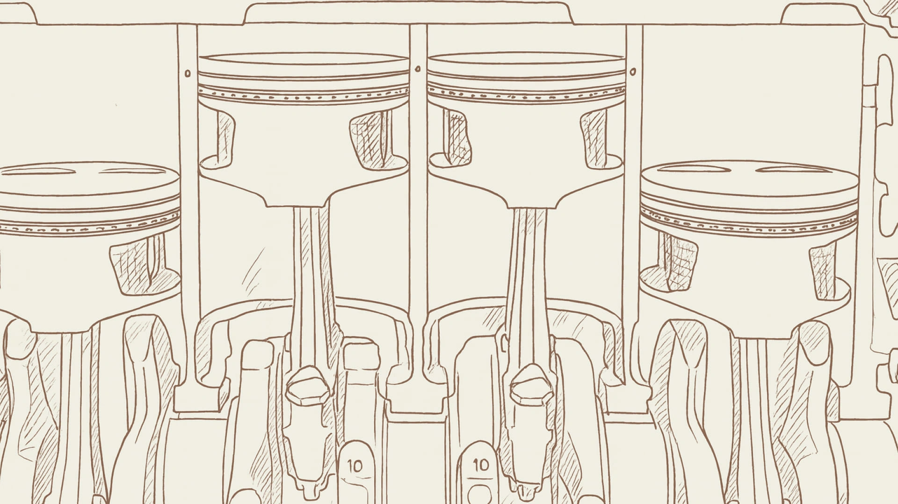

# Head Editor

**id**: pe-ratio
**title**: P/E Ratio : When valuing a stock, don't just look at the numbers! You need to understand the business behind those numbers.
**description**: Want to learn how to use the P/E ratio to pick winning stocks? We’re starting with the basics of the P/E formula and diving into what those high and low numbers actually say about market sentiment. Plus, we’re sharing our exclusive 'Earnings Quality Checklist' to help you avoid the value traps that often hide in low P/E stocks, so you can start evaluating businesses like a pro.
**keywords**: Price-to-earnings ratio, P/E ratio, P/E ratio calculation, how to calculate P/E, high vs low P/E ratios, what’s a good P/E ratio, low P/E stocks, stock picking with P/E, P/E ratio band chart, value trap, earnings per share, EPS, price-to-book ratio.
**list-summary**: Never just look at the number. You gotta understand the actual business behind that number.
**name**: P/E Ratio

---

# Hero Editor

	

		

			<h1>P/E Ratio : When valuing a stock, don't just look at the numbers! You need to understand the business behind those numbers.</h1>
			
The P/E ratio is the standard unit we use to compare prices across different stocks. The formula is simply the current stock price divided by the earnings per share from the last year. In other words, the P/E ratio tells you exactly how much price you have to pay for every single dollar the company earns. That is why the unit is always expressed as a "multiple."

			
For example, let's say ABC Corp is trading at $49. If they brought in $3.50 in earnings per share last year, their P/E ratio works out to be 14 times.

		

	

	

---

# Content Editor

	

		
In the stock market, the big question is always, "Is this stock expensive or cheap?"

		
When you see Company A trading at $1,000 and Company B at $100, your gut reaction is to think A is pricier. But is it really? A stock price depends on how much money the company makes and how many shares exist. Maybe Company B just has a massive number of shares out there, which waters down the price. If Company A is actually way more profitable, can you really call that $1,000 price tag "expensive"?

		
When the share counts are different, the starting lines aren't the same. That is why we should calculate the P/E ratio to make a comparison. Even though there are plenty of other factors to consider and no comparison is perfect, it is still way more objective than just staring at the raw stock price.

		
It is basically like real estate. Is a 20-million-dollar house necessarily "more expensive" than a 15-million-dollar one? You have to calculate the price per square foot to really know what you're getting.

	

	

		<h2>What is the P/E ratio?</h2>
		
The Price-to-Earnings Ratio, or P/E, is a figure derived from earnings per share. This means that no matter how big or small a company is, you can weigh them on the exact same scale using the same pricing method. It is just like that price-per-square-foot concept for houses we talked about earlier.

		
There is a very intuitive idea behind the P/E ratio: "How many years will it take for me to make my money back?" It sounds simple enough. If a company has a P/E of 20, it seems to imply you have to wait 20 years to recoup your principal. When you look at the formula, it sounds like it makes sense. But is that actually how it works?

		<h3 class="inside">The P/E calculation formula</h3>
		

			

				
P/E Ratio = Current Stock Price / Earnings Per Share (EPS)

			

		

		
The formula itself is super simple. It basically asks, "How many times the company's earning power is the current stock price worth?" But we need to dig a little deeper. Which "EPS" number should we actually use for the denominator?

		<ul>
			<li><strong>Historical P/E</strong>: This is the number you see on most financial websites. The good thing is that it is objective and clear because the data has already happened. The bad thing is that it is like driving while looking in the rearview mirror. It assumes the company's future will look exactly like its past.</li>
			<li><strong>Forward P/E</strong>: This uses analysts' predictions for the company's future EPS. This is closer to the true nature of investing because we are buying the company's future. However, a prediction is still just a prediction. It can be wrong, or it might even be biased.</li>
		</ul>
		
Both approaches make sense, but here is Warren Buffett's take on it. Since predictions are often wrong, he prefers using past data to avoid that risk. But to avoid being misled by a short period of good luck, you have to look for companies that have been listed for a long time and show "stable growth." You want to be as sure as possible that the future growth track will look similar to the past.

		<h3 class="inside">Don't be misled by the "break-even" concept</h3>
		
"A P/E of 10 means I break even in 10 years." That sounds reasonable, and that was probably the original idea behind the ratio. But that isn't really how it works in practice, and I need to make sure you don't get the wrong idea.

		
The money a company makes isn't equal to the money you get. Imagine your coffee shop nets a million bucks this year. Are you going to stuff all of it into your pocket? Probably not. You might spend 600k on a new roaster or a remodel so you can make even more money next year. The remaining 400k is the only cash you can actually take home.

		
Public companies are the same way. A small chunk of the earnings gets paid back to shareholders as "dividends," but usually, a much larger chunk gets "retained." This money is used for reinvestment—like researching new products, expanding factories, or buying out competitors—all to drive future growth.

		
I am not here to debate whether the "years to break even" concept is right or wrong technically. I just want to make sure your thinking is clear. Once you get this, we can move on to discussing the P/E ratio correctly.

	

	

		<h2>What does a high or low P/E tell you? Reading market sentiment</h2>
		
If you’ve ever learned that "a P/E over 20 is expensive and under 12 is cheap," I want you to forget that right now. Different industries and different times mean different P/E levels. There is no standard answer that fits every stock.

		
Think of the P/E ratio as a "thermometer for market sentiment." It measures what the market expects from a company’s future. Once you look at it that way, everything starts to make sense.

		<h3 class="inside">High P/E: a sign of future growth or just a bubble?</h3>
		
When you see a company with a P/E of 30, 50, or even higher, it means investors are willing to pay a relatively high price today to buy into its future growth. You usually see this in fast-moving industries like tech or biotech.

		
Investors believe the company's earnings will shoot up, making today's expensive price look reasonable down the road. For example, say a company earns $3 per share this year with a P/E of 40. I expect it to grow fast, so I buy in. If it makes $6 per share next year, that effectively brings my P/E down to just 20.

		
But that is exactly where the risk is. If that expectation is built on nothing but hype and dreams without real profits to back it up, it becomes a dangerous game of "trading on hopes." Once the dream bursts, the price correction is going to be brutal.

		<h3 class="inside">Low P/E: did you find a bargain or fall into a value trap?</h3>
		
When you find a stock with a low P/E, your gut tells you it’s a bargain. It might be an opportunity, but you have to ask yourself: "Why is the market putting this on the discount rack?"

		
Sometimes a used car isn't cheap because the owner is generous. It’s cheap because there are hidden problems under the hood. Be careful. A low P/E can be an opportunity, but it can also be a warning sign that the market thinks the company’s profits are tanking and its future looks bleak. If you buy just because it’s cheap, you might fall right into a "value trap."

		<h3 class="inside">Context is key: learn to compare with the industry and history</h3>
		
So, how do we spot a real opportunity? The answer is "context." Looking at a P/E number in isolation is pretty meaningless. You have to compare it within a specific context.

		<ul>
			<li><strong>Industry comparison</strong>: Business models and growth prospects vary wildly between industries, so the "reasonable" P/E range changes too. A P/E of 15 might be fair for a mature food company, but for a high-growth AI software company, a P/E of 15 probably means the market has zero confidence in it. You should compare Apple to Samsung, not Apple to Coca-Cola.</li>
			<li><strong>Historical comparison</strong>: Compare the company to its own past. Check what P/E range it usually sits in. You can visualize this with a "P/E River Chart." It plots the stock price against various historical P/E multiples on one chart. You can instantly see if the current price is sitting in the expensive zone or the cheap zone.</li>
		</ul>
		
Remember this! Even if you find a stock where the P/E looks low in both contexts, you still have to pop the hood and check why it is low. Did the market make a mistake? Or is there something fundamentally wrong with the business?

	

	

		<h2>What to watch out for when picking stocks with P/E ratios? Remember to pop the hood and check the quality of those earnings</h2>
		
Once you know how to compare P/E ratios against competitors and historical trends, and you’ve filtered out some good candidates, you still need to pop the hood and check the profit engine. The quality of earnings is the core factor that determines a company's long-term value.

		<h3 class="inside">Question 1: is the profit coming from sustainable core income or a one-time windfall?</h3>
		
Before you get sucked in by a tempting low P/E, check this first. Trust me, it will help you filter out 80% of the potential traps.

		
We want to invest in sustainable earning power, not just a lucky lottery win. Take a look at the income statement and make sure the profit is coming from the core business, not from selling off land, factories, or financial investments. Those are "one-time" gains. A huge one-time profit can artificially push the P/E ratio down and give you the illusion that the stock is cheap.

		<h3 class="inside">Question 2: is the company actually making cash or just "accounts receivable" on paper?</h3>
		
Profits on financial statements can be dressed up, but cash flow doesn't lie. For a healthy company, the long-term "operating cash flow" should be close to (or even higher than) the "net profit after tax" on the books.

		
If a company shows huge profits on its report but the cash in its pocket isn't growing to match, that is a dangerous red flag. It doesn't matter what the reason is. If they can't collect the money, those paper profits might eventually turn into nothing.

		<h3 class="inside">Thinking about "value traps" and "high-quality compounding" through hypothetical cases</h3>
		
Company A is a large electronics contract manufacturer. Its P/E is only 10, way lower than the market average of 15-20. It looks like a total steal. The profit is indeed coming from its core business, but we notice the profit margins are sliding, and over 50% of its revenue relies on a single client. That is super risky. Operating cash flow often lags behind net profit, which suggests their bargaining power might be weakening and collecting payments is getting tough (after all, the bigger the client, the more say they have).

		
That 10x P/E is simply the market's fair price for "high risk, low margin, and low growth." If you buy it just because you think it's cheap, you are going to fall into a typical value trap.

		
Company B is a connector manufacturer focused on a high-end niche market. It has a P/E of 20. By traditional standards, that might seem a bit pricey. However, 100% of its profit comes from its core business, and its products are used across medical, green energy, and industrial sectors, so it isn't tied to the ups and downs of a single industry. Operating cash flow has been solid for the past decade and grows right alongside net profit. This shows their earnings are solid cash.

		
That 20x P/E reflects that the market is willing to pay a premium for "high-quality profitability, stable cash flow, and sustained growth." This is the kind of high-quality compounding company you can hold onto for the long term.

	

	

		<h2>Does the P/E ratio ever fail? Here is when you need other tools</h2>
		
The P/E ratio is great for sizing up companies with stable, predictable profits. But when you run into certain situations, you’ll realize this method just doesn't cut it. Let's look at where it falls short.

		<h3 class="inside">Companies losing money show negative P/E ratios</h3>
		
Have you ever seen a "negative" or "N/A" P/E ratio? That basically means the company is currently losing money (negative EPS), so the math gets weird. In this case, the whole concept of "years to break even" completely loses its meaning.

		
That doesn't mean the company is totally worthless, though. It just means your reason for investing can't be based on current profitability. Instead, you are betting on the expectation that they will turn things around in the future. A lot of startups and new biotech companies fall into this category.

		<h3 class="inside">Besides P/E, you should know about the P/B ratio</h3>
		

			

				
P/B Ratio = Current Stock Price / Book Value Per Share

			

		

		
When negative earnings make it impossible to calculate a P/E ratio, and you are absolutely dead set on analyzing the company (usually I'd suggest just skipping money-losers), you can switch to looking at the "Book Value." That is basically the money shareholders would get back if the company sold off all its assets and paid off all its debts.

		
The P/B ratio measures how many times the current stock price is worth compared to the company's net assets on paper. It is especially useful in these two situations:

		<ol>
			<li><strong>Evaluating companies that are losing money</strong>: Even if a company is running at a loss for now, as long as it has real assets like factories, equipment, and cash, its book value is usually still positive. The P/B ratio helps you judge if the liquidation value is higher than the stock price and if they have enough stamina to survive until they become profitable again. It gives you a reference for a margin of safety.</li>
			<li><strong>Evaluating cyclical stocks</strong>: For companies in industries like steel, construction, or shipping, profits tend to swing wildly with the economy. That makes the P/E ratio jump all over the place, making it hard to use. Book value, however, stays relatively stable. So, when the economy is at the bottom of a cycle and profits look bad, many value investors use the P/B ratio to hunt for opportunities where the stock price is overly undervalued.</li>
		</ol>
	

	

		<h2>The P/E ratio is the market's price tag</h2>
		
I hope you really grasp this by now. The P/E ratio is basically just a form of market pricing. It tells you the price people are willing to pay to get a piece of a company's earning power.

		
More often than not, the P/E ratio actually reflects the market's current mood. And when we talk about "mood," there is definitely some irrationality involved. So, you need to evolve your way of thinking. Instead of asking "What is a fair P/E number?", start asking "Why is the market giving it this price?" That makes it a lot easier to figure out what Mr. Market is thinking.

		
You shouldn't be trying to become just another player chasing numbers up and down. You want to be an entrepreneur who understands the true nature of business. That is why you are here, right? Try to understand the actual business behind the stock price. That way, you can judge if the price Mr. Market is offering is driven by too much fear or too much greed.

	

