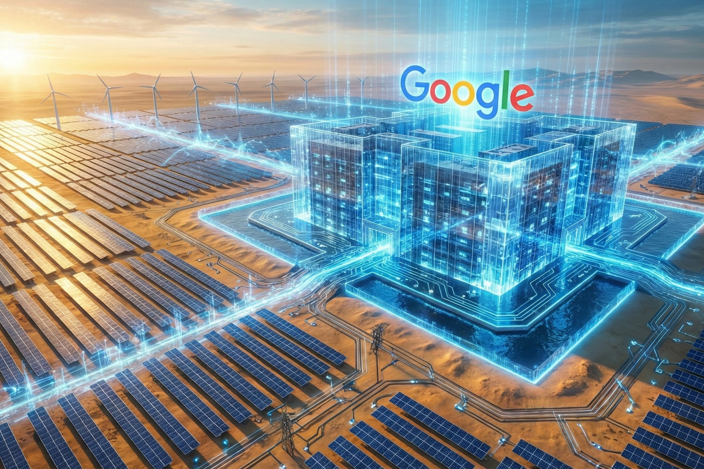

# Head Editor

**id**: 20251222-alphabet-acquires-intersect-power-ai-energy-strategy
**title**: Alphabet drops $4.75 billion on an energy company. Is this the new moat for the AI era?
**description**: Alphabet is buying clean energy company Intersect Power for $4.75 billion to tackle the surging electricity demand driven by AI development. Facing a tough situation in Texas, where grid connection requests for data centers have quadrupled in just 14 months, Alphabet is vertically integrating its energy supply to make sure its AI infrastructure keeps expanding smoothly.
**keywords**: Alphabet acquisition, Google AI power, Intersect Power acquisition, data center power demand, AI power shortage, renewable energy investment, ERCOT power applications, vertical energy integration, Sheldon Kimber, AI infrastructure
**Source**: https://www.cnbc.com/2025/12/22/alphabet-to-acquire-intersect.html
**TAGs**: Tech
**date**: 2025-12-22

---

# Hero Editor

	

		

			<h1>Alphabet drops $4.75 billion on an energy company. Is this the new moat for the AI era?</h1>
			

				<time datetime="2025-12-22">2025-12-22</time>
				<ul class="tags">
					<li class="yolk">Tech</li>
				</ul>
			

		

	

	

---

# Content Editor

	

		
Alphabet (Google’s parent company) dropped a bombshell on December 22, 2025, announcing it’s buying Intersect Power, a major player in data center and energy infrastructure, for $4.75 billion in cash plus taking on their debt. This deal isn’t just a tech giant dipping its toes into energy; it’s a clear signal that the AI race has moved beyond just cloud algorithms and into physical power plants and grids.

		<ul>
			<li><strong>Feeding the AI energy beast</strong>: With the generative AI arms race heating up, the amount of power data centers need is skyrocketing. Securing a steady, massive electricity source has become priority number one for anyone trying to dominate the AI landscape, which is exactly why this deal happened.</li>
			<li><strong>Taking control of their own power</strong>: Traditionally, building huge data centers means dealing with grid limits and red tape. By buying an energy developer outright, Alphabet can sidestep those grid bottlenecks and plan power plants and data centers together, giving them total control over their energy supply.</li>
			<li><strong>Building an infrastructure edge</strong>: This move isn’t just about today’s power needs; it’s a smart long-term play. By locking down its own energy supply chain, Alphabet is protecting its AI and cloud growth from fluctuating prices or power shortages on the public grid. It’s basically building an "energy moat" that makes it much harder for competitors to keep up.</li>
		</ul>
		

			
💡

			
<strong>Intersect Power</strong> is a San Francisco-based clean energy firm founded by Sheldon Kimber back in 2016. They specialize in building and running massive clean energy projects, like solar and wind farms that come equipped with their own on-site battery storage systems. Their whole mission is to provide low-carbon power and fuel to industries that guzzle energy, especially data centers.

			
What really sets them apart is their "power-first" approach. They advocate for a co-location model, which basically means setting up massive industrial hubs like data centers right next to dedicated renewable energy and storage sites. Doing it this way speeds up construction, takes the pressure off the existing power grid, and makes sure the energy supply is both reliable and affordable.

		

	

	

		<h2>AI isn't just about building data centers anymore; it's a battle for power</h2>
		
This deal isn't just a one-off purchase; it's a calculated strategic move. When you look at how this is set up and the serious "power anxiety" behind it, it's clear that electricity has become the new battlefield. According to the official statement, here is the breakdown of the deal.

		<ul>
			<li><strong>Core assets</strong>: The deal includes Intersect Power’s world-class team and several gigawatts worth of energy and data center projects currently in the works. These projects grew out of their existing partnership with Google, so they will plug right into Alphabet’s expansion plans.</li>
			<li><strong>What’s not included</strong>: It’s worth noting that Intersect Power’s current operating assets in Texas and everything they have in California (both running and in development) are not part of this buyout. Those assets will keep running as an independent company, backed by current investors like TPG Rise Climate.</li>
			<li><strong>How it will run</strong>: Once the deal closes, Intersect Power will keep its own brand and continue to be led by founder and CEO Sheldon Kimber. The team will work hand-in-hand with Google’s tech infrastructure crew to push forward on current and new projects.</li>
		</ul>
		

			
💡

			
<strong>1 GW</strong> (gigawatt) is 1 billion watts. It's a unit used to measure power capacity. To put that in perspective, a typical home uses about 3 to 5 kilowatts during peak times. That means, in theory, 1 GW can power 200,000 to 300,000 homes at once. Basically, it’s enough to handle the total energy load for a mid-sized city during its busiest hours.

		

		<h3 class="inside">Why power became the strategic resource for the AI wars</h3>
		
Training AI models is a total power hog because it requires massive parallel processing. Even running those models (inference) adds up fast since they have to be available 24/7. To put it in perspective, a traditional server rack pulls about 5 to 15 kilowatts, but AI-optimized racks are pushing 40 to 60 kilowatts or even more.

		
Texas is the hotspot for data centers right now. Data from ERCOT (the Electric Reliability Council of Texas) shows that requests to hook up to the grid are growing at a crazy rate. In just 14 months, applications jumped more than four times, leading to grid capacity shortages and serious delays in the approval process. Even if a tech company has the cash, the land, and the GPUs, they’re stuck if they can’t get a steady power supply.

		<ul>
			<li><strong>September 2024</strong>: Total grid connection requests were at 56 GW.</li>
			<li><strong>September 2025</strong>: The total surged to 189 GW, with data centers making up about 69%.</li>
			<li><strong>November 2025</strong>: That number climbed even higher to 226 GW, with data centers now accounting for 77%.</li>
		</ul>
		<h3 class="inside">A calculated long-term move, not just a random decision</h3>
		
In reality, this acquisition is just the next step in Alphabet’s long-term energy strategy rather than a last-minute call. Google has been making a lot of moves in the energy space lately, and they were actually a minority investor in Intersect Power long before this deal was announced.

		<ul>
			<li><strong>Google</strong> signed the biggest hydropower deal in history with Brookfield Asset Management.</li>
			<li><strong>Google</strong> also formed a massive partnership with the energy giant NextEra Energy. They are teaming up to build several gigawatt-scale data center campuses across the U.S., combining their expertise to get land and power connections ready for use as quickly as possible.</li>
			<li>According to official statements, Alphabet is focused on finding new ways to speed up the commercial use of advanced energy tech, including next-gen geothermal, long-term energy storage, and natural gas plants that use carbon capture and storage.</li>
		</ul>
	

	

		<h2>AI giants’ energy chess match</h2>
		
Alphabet’s move isn’t just getting people in tech talking; the market is actually loving it too. This deal is being seen as a major step for tech giants to handle the AI era, and it shows how the whole competition is shifting.

		
Wall Street’s reaction was pretty positive. According to CNBC, Alphabet’s stock went up about 0.5% after the news broke. Analysts at BNP Paribas Exane called the buyout a "prudent investment." The general consensus on Wall Street is that by locking down its own energy, Alphabet can guarantee growth for its AI and cloud businesses while keeping a tight lid on costs and construction timelines.

		
The AI battle has officially moved past just code and chips. Now, it’s a fight for control over physical stuff like energy and land. Google CEO Sundar Pichai’s statement really hit home: he said Intersect Power will help them scale up and be more flexible in building power plants that match their data center needs, all while "reimagining energy solutions to drive innovation and leadership in the U.S." Basically, the future of infrastructure is now tied directly to energy innovation.

	

	

		<h2>Vertical integration 2.0 for AI dominance</h2>
		
For the last twenty years, Google’s success was built on controlling software and data, let's call that vertical integration 1.0. Now, Alphabet is rolling out version 2.0. They’re managing the whole chain, from generating, moving, and storing electricity to the actual chips and the final AI output.

		Having total control "from the power plant to the chat box" lets them squeeze out every bit of energy efficiency. While competitors are stuck waiting in line to get power from the public grid, Alphabet can steadily grow its computing power without skipping a beat.
		<h3 class="inside">Clean energy developers becoming the strategic core</h3>
		
In the past, clean energy companies like Intersect Power were just seen as providers of green energy for utility companies or firms looking for carbon offsets. But under Alphabet’s model, these companies have become "outposts" for AI infrastructure. Over the next few years, energy companies that have land, a spot in the grid connection line, and battery tech are going to be huge targets for tech giants and private equity firms. Their value is shifting from being just a "utility company" to being essential "tech infrastructure."

	

