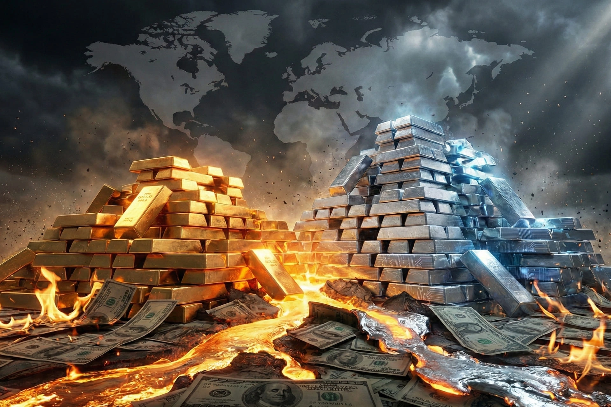

# Head Editor

**id**: 20251222-gold-silver-price-record-high-2026-market-analysis
**title**: Gold and silver hit all-time highs! How the Trump effect, Fed rate cuts, and geopolitics are pushing gold past $4,470
**description**: Gold is breaking past $4,470, and silver is skyrocketing by a record-breaking 138%! In this post, we're taking a deep dive into the safe-haven sentiment triggered by the 'Trump effect,' expectations for Fed rate cuts in 2026, and how a weak US dollar is driving precious metals. We'll also break down the industrial demand for silver in the green energy sector, and analyze the winners and losers in mining and jewelry as prices soar, helping you stay clear-headed during this boom cycle.
**keywords**: Gold prices hit record highs, silver price trends, safe-haven asset allocation, Trump effect on gold prices, Fed rate cut forecast, 2026 gold price analysis, geopolitical risk investing, industrial demand for silver, green energy costs, gold and silver mining stocks
**Source**: https://www.bbc.com/news/articles/cd74ldr2zryo
**TAGs**: Global, Investing
**date**: 2025-12-22

---

# Hero Editor

	

		

			<h1>Gold and silver hit all-time highs! How the Trump effect, Fed rate cuts, and geopolitics are pushing gold past $4,470</h1>
			

				<time datetime="2025-12-22">2025-12-22</time>
				<ul class="tags">
					<li class="yolk">Global</li>
					<li class="yolk">Investing</li>
				</ul>
			

		

	

	

---

# Content Editor

	

		
Monday marked a historic moment for global financial markets as both gold and silver prices smashed all-time highs. Gold even broke through the $4,470 per ounce barrier, while silver hit a fresh record of its own. This massive rally is the result of a few major global factors coming together at once.

		<ul>
			<li><strong>Geopolitical drama</strong>: Between the ongoing US-China trade war and rising global conflicts, political uncertainty is forcing investors to look for safety. They are parking their money in gold, the ultimate safe-haven asset when things get tense.</li>
			<li><strong>Expected rate cuts</strong>: Most people expect the Fed to cut interest rates twice in 2026. When rates go down, bonds and other fixed-income assets aren't as attractive, so investors are turning to commodities to get better returns.</li>
			<li><strong>A weaker dollar</strong>: As the U.S. dollar loses steam, it makes gold much cheaper and more appealing to international buyers using other currencies.</li>
		</ul>
	

	

		<h2>The crazy rally in precious metals</h2>
		
The record-breaking surge in gold and silver isn't just a fluke; it's the result of a complex mix of economic, political, and market forces. I don't think the price itself is the most important part. The real takeaway is how global investors are completely shifting their strategy on where to put their money.

		<h3 class="inside">The Trump effect and the rush to safety</h3>
		
Adrian Ash, the director of research at BullionVault, pointed out that President Trump’s actions "really lit a fire under things, and gold has gone absolutely wild this year." Ash didn't mince words, saying, "You’ve got trade wars, attacks on the Fed, and geopolitical tension, and all of these provocations are coming from Trump."

		
Geopolitical chaos is the main spark behind the flight to safety. Gold prices are up over 68% this year, marking the biggest annual jump since 1979.

		
Other geopolitical events are adding to the market's jitters, like the U.S. sanctions on Venezuela. While that move directly pushed up oil prices, it also shows how global tensions are propping up safe-haven assets like gold.

		<h3 class="inside">The Fed's dovish signals and the weakening dollar</h3>
		
Interest rate expectations and the direction of the dollar are the other two main pillars holding up gold prices. Analysts generally expect the Fed to cut rates twice in 2026, which means the return on things like bonds is going to drop. Because of that, investors looking for better returns and a more diverse portfolio are naturally turning to commodities like gold that don't pay interest.

		
At the same time, a weak dollar is giving gold prices an extra boost. In the first half of 2025, the dollar’s value plummeted about 11% against a basket of other currencies, sending global investors on a hunt for alternatives. Many individual investors and institutions are realizing they are seriously underweight in gold.

		<h3 class="inside">The global race for gold reserves</h3>
		
According to analysis from Goldman Sachs, this gold rush isn't just about retail and institutional investors. Central banks are also jumping into the game with more energy than ever, driven by three main reasons:

		<ol>
			<li><strong>Dealing with economic chaos</strong>: Boosting gold holdings to protect reserve values when the economic outlook is blurry.</li>
			<li><strong>Reducing reliance on the dollar</strong>: Diversifying foreign exchange reserves so they aren't so dependent on a single currency (the U.S. dollar).</li>
			<li><strong>Portfolio diversification</strong>: Using gold as an effective tool for asset allocation.</li>
		</ol>
		<h3 class="inside">The industrial engine driving silver and platinum</h3>
		
Unlike gold, which is mostly driven by the search for safety, the rally in silver and platinum is also being fueled by strong industrial demand. On Monday, silver hit a record high of $69.44 an ounce, bringing its year-to-date gains for 2025 to a staggering 138%. Meanwhile, platinum prices climbed to a 17-year high, even outperforming gold, which highlights how much industrial demand is supporting certain precious metals.

		
Analysts say silver and platinum prices are being pushed up by a combination of high manufacturing demand and supply chain bottlenecks. The Silver Institute even called silver the "next-generation metal" in a report, saying it plays an essential role in high-growth areas like clean energy and digital innovation.

	

	

		<h2>How much longer can this party last?</h2>
		
Even though market sentiment is through the roof right now, history always reminds us that the commodity market is super cyclical. While everyone is cheering for these record prices, we need to keep our heads on straight. Jim Wyckoff, a senior analyst at Kitco Metals, points out that raw materials go through "boom and bust cycles." He uses a great baseball metaphor, saying we might be in the "8th or 9th inning" of this run. This suggests that while there might still be some room to go up, the risks are skyrocketing. Gold and silver are naturally volatile, so chasing these highs actually goes against the original point of using them for safety. In fact, it might just be exposing your portfolio to way more risk.

		<h3 class="inside">Oil prices and other economic indicators</h3>
		
To get a better look at the whole economic picture, we should watch what’s happening in other markets too. On the same day gold and silver took off, Brent and U.S. oil prices rose a bit, but they’re still likely to end the year lower than where they started. This shows that the current craze isn't just a broad bull market for all commodities. Instead, it’s being driven specifically by the demand for safety and industrial needs for precious metals, which makes this rally pretty unique.

	

	

		<h2>Winners and losers at these high prices</h2>
		
Precious metals aren't just a safe haven; they are also essential raw materials. With prices hitting all-time highs, the way profits are handed out across the supply chain is being completely reshuffled.

		<h3 class="inside">Clean energy and electronics manufacturing</h3>
		
The spike in silver and platinum is a massive challenge for industries in the middle of a green energy transition. Silver is a core part of the conductive paste in solar panels and a must-have for electronics in electric vehicles. As silver breaks $60 an ounce and marches toward $70, the cost to produce solar modules is going to jump. This might force manufacturers to move faster on "de-silvering" tech, like using copper or other alloys as a backup. They might also just pass those costs on to consumers, which could slow down how fast clean energy gets rolled out globally in the short term.

		<h3 class="inside">The mining and exploration industry</h3>
		
For gold and silver mining companies, this rally is a total lifesaver. Since profit margins are widening, even "low-grade" deposits that were too expensive to touch before are now worth mining. The big mining giants are flush with cash and are actively looking to buy up smaller exploration firms to grab more land rights. Companies are also more willing to spend on automated mining and deep-drilling tech to keep up with environmental rules and the need to dig deeper.

		<h3 class="inside">Luxury and retail jewelry: feeling the pinch</h3>
		
While investment demand is on fire, the actual jewelry market is looking pretty quiet. With gold sitting at $4,400 an ounce, the demand for wedding jewelry and decorative pieces is taking a big hit. Jewelers might start pushing lower-karat gold, like 9K or 14K, or designs mixed with synthetic materials to keep prices somewhat affordable. We are also seeing a massive wave of people selling their old gold. Recycling old jewelry has become the main way for local shops to make money while the retail side is in a slump.

	

