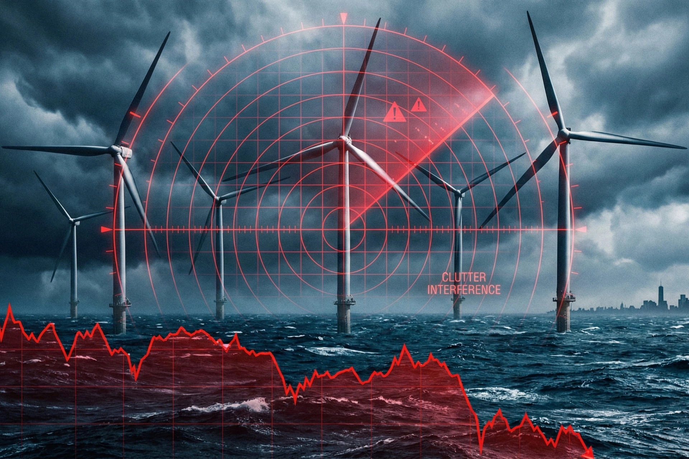

# Head Editor

**id**: 20251222-trump-suspends-us-offshore-wind-national-security-impact
**title**: Trump halts East Coast offshore wind in surprise 'national security' move!
**description**: The Trump administration's sudden suspension of five major East Coast offshore wind projects over national security concerns has sent Orsted's stock tumbling. This article takes a deep dive into the truth behind the radar interference claims, expert skepticism over the political motives, and how this move impacts the green power supply for AI data centers and threatens the U.S. energy transition, providing investors with a comprehensive financial breakdown and industry impact assessment.
**keywords**: Trump offshore wind, U.S. energy policy, Orsted stock price plunge, national security threats of offshore wind, Vineyard Wind 1, radar interference clutter, green electricity for AI data centers, energy transition risks, U.S. renewable energy shutdown, energy project approval reform
**Source**: https://www.bbc.com/news/articles/cd74lyr094vo
**TAGs**: Energy, Politics
**date**: 2025-12-22

---

# Hero Editor

	

		

			<h1>Trump halts East Coast offshore wind in surprise 'national security' move!</h1>
			

				<time datetime="2025-12-22">2025-12-22</time>
				<ul class="tags">
					<li class="yolk">Energy</li>
					<li class="yolk">Politics</li>
				</ul>
			

		

	

	

---

# Content Editor

	

		
Out of nowhere, the Trump administration used national security as a shield to launch a surprise attack on five major offshore wind projects along the East Coast. They ordered a full stop for at least 90 days, which is a total bombshell for the booming clean energy industry. The official line is that wind turbines might mess with military radar and pose a security threat, but the move sparked instant backlash from state governments, environmental groups, energy companies, and even national security experts.

		
Energy stocks tanked on the news, and a massive political and economic storm over the future of American energy is quickly picking up steam. This 90-day halt directly hits these five key projects that are currently in development or in their late stages:

		<ul>
			<li><strong>Vineyard Wind 1</strong> (Massachusetts)</li>
			<li><strong>Revolution Wind</strong> (Rhode Island and Connecticut)</li>
			<li><strong>Coastal Virginia Offshore Wind</strong> (CVOW) (Virginia)</li>
			<li><strong>Sunrise Wind</strong> (New York)</li>
			<li><strong>Empire Wind 1</strong> (New York)</li>
		</ul>
	

	

		<h2>Offshore wind’s sudden halt: national security or just politics?</h2>
		
The Trump administration is framing this sudden move as a national security issue. Interior Secretary Doug Burgum and the Department of the Interior claim that those massive turbine blades and reflective towers create something called "Clutter" on military radar systems. They’re basically saying this interference could hide actual moving targets like planes or missiles, or even create fake signals, which is a big risk for our air defense.

		
The government is also claiming the decision is backed by a recent DOD assessment featuring new classified info about how "hostile technology" is evolving. They’re emphasizing that because these wind farms are so close to major population centers on the East Coast, any vulnerability is a huge deal. That’s why they’re hitting the pause button for 90 days to look into risks and fixes, and they’ve already said they might extend that timeline if they need to.

		

			
💡

			
<strong>Clutter</strong> refers to radar echoes caused by unwanted targets like buildings, waves, or in this case, wind turbines. These echoes can make it harder for the radar to spot real targets.

		

		<h3 class="inside">Outcry from politicians, environmentalists, and experts</h3>
		
What really sets them apart is their "power-first" approach. They advocate for a co-location model, which basically means setting up massive industrial hubs like data centers right next to dedicated renewable energy and storage sites. Doing it this way speeds up construction, takes the pressure off the existing power grid, and makes sure the energy supply is both reliable and affordable.

		
The "national security" explanation isn't exactly flying with everyone. Instead, it has triggered a massive wave of skepticism and criticism.

		<ul>
			<li><strong>Political pushback</strong>: Four Democratic governors from Connecticut, Massachusetts, New York, and Rhode Island released a joint statement, slamming the move as "a lump of coal for American workers, consumers, and investors." Connecticut Governor Ned Lamont went even further, calling it "another erratic, anti-business move." He warned that halting these near-finished projects puts thousands of high-paying jobs at risk, will drive up electricity prices, and hurts the reliability of the regional power grid.</li>
			<li><strong>Backlash from industry and environmental groups</strong>: Groups like the Sierra Club and the Environmental Defense Fund are calling this a "malicious attack" and "retaliation" against the clean energy sector. Wind power advocates are even calling the move illegal. They pointed out that while the country's energy demand is skyrocketing, it makes no sense for the government to intentionally block America's biggest renewable energy source.</li>
			<li><strong>National security experts weigh in</strong>: Kirk Lippold, the former commander of the USS Cole, is questioning the government's logic from a professional standpoint. He noted that radar interference has been public knowledge for decades, and the DOD was involved throughout the years-long approval process without raising any objections. He asked, "I want to know, what exactly changed? What threat factor is different now?" His point gets right to the heart of the matter: if radar issues are old news and the DOD was already on board, this sudden "new threat" looks a lot like a political excuse.</li>
		</ul>
		<h3 class="inside">Immediate economic and industry fallout</h3>
		
The market's reaction was fast and brutal. Danish energy giant Orsted was hit the hardest, with its stock price tanking more than 11% right after the announcement. Two of its projects, Revolution Wind and Sunrise Wind, are on the pause list. Other companies like Dominion Energy and Equinor also saw their shares drop.

		
Dominion Energy warned that pausing its Virginia project would directly threaten the power reliability for local customers, which includes major military bases and the data centers driving the AI boom. It is a pretty sharp irony: the government is taking action in the name of national security, but in doing so, it is threatening the power stability that military bases and other critical security infrastructure actually need to survive.

	

	

		<h2>Trump’s long-standing war on wind power</h2>
		
Trump himself has had a bone to pick with wind power for a long time. He’s constantly bashed wind turbines in public, calling them "ugly," "expensive," and "inefficient," and he’s even claimed they’re a threat to birds and whales.

		
The timing of this halt is also extremely touchy. Just two weeks ago, a federal judge in Massachusetts ruled that Trump’s previous attempts to block wind projects were "illegal" and "arbitrary." This new move, framed as a "national security" issue, is being widely interpreted as a political workaround to sidestep the courts and keep taking shots at the renewable energy industry.

		
This isn't just about one specific policy decision. It could have a ripple effect on future energy reforms and political cooperation, casting a serious shadow over the country’s path toward an energy transition.

		<h3 class="inside">The policy pendulum and the risk of long-term contract defaults</h3>
		
Offshore wind projects usually take 10 to 15 years to develop, which makes them sitting ducks for the "policy pendulum." This is basically what happens when every new administration tries to tear down the energy legacy of the one before it.

		<ul>
			<li><strong>A chain reaction of defaults</strong>: If this 90 day shutdown gets extended, it could trigger "force majeure" clauses in Power Purchase Agreements (PPAs), causing those contracts to fall apart.</li>
			<li><strong>Sovereign credit risk</strong>: When the government constantly uses executive orders to interfere with business, the U.S. loses its reputation as a stable place for global investment. This makes it a lot harder to attract foreign capital in the long run.</li>
			<li><strong>Energy inflation risk</strong>: If the gap left by green energy is filled by older, more expensive power plants, those higher costs will eventually be passed on to everyday consumers and businesses, creating potential inflation pressure.</li>
		</ul>
	

