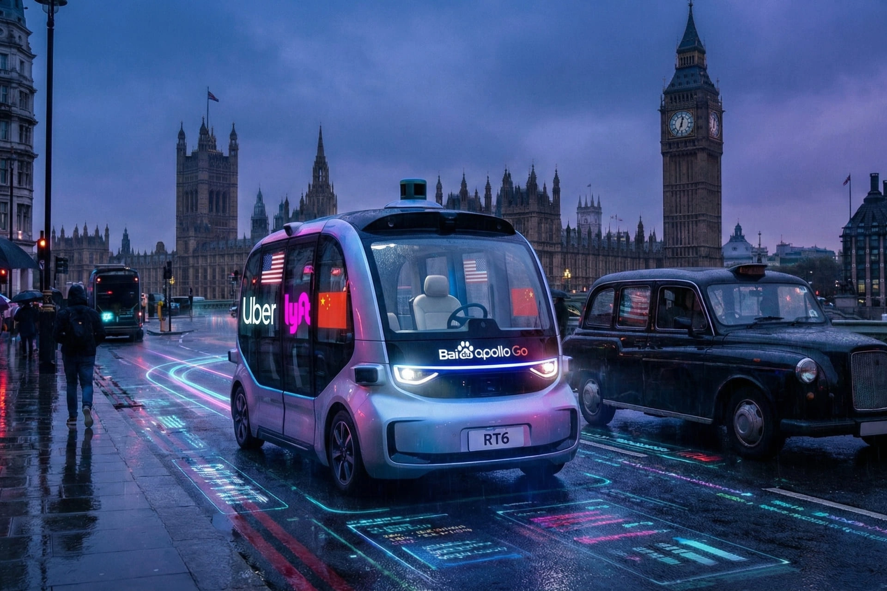

# Head Editor

**id**: 20251222-uber-lyft-baidu-london-robotaxi-2026
**title**: Robotaxi war hits the streets of London: Uber and Lyft team up with Baidu's Apollo Go to launch in 2026!
**description**: Uber and Lyft have announced a partnership with Baidu's Apollo Go to deploy robotaxis in London in 2026. Boosted by the UK's Automated Vehicles Act, which clarifies liability, this move is set to push ride-hailing platforms toward an algorithm-driven model and reshape both actuarial insurance and EV charging supply chains. While the technology has logged over 240 million kilometers, Baidu's entry has sparked data sovereignty and national security concerns, and safety in low-light conditions remains a critical test for public trust.
**keywords**: Uber, Lyft, Baidu, Apollo Go, robotaxi, autonomous driving, London transport, Automated Vehicles Act 2024, RT6, U.S.-China tech war, transportation sector transformation, UK national security
**Source**: https://www.bbc.com/news/articles/cy8jmx1dl9ro
**TAGs**: Robotaxi, Global
**date**: 2025-12-22

---

# Hero Editor

	

		

			<h1>Robotaxi war hits the streets of London: Uber and Lyft team up with Baidu's Apollo Go to launch in 2026!</h1>
			

				<time datetime="2025-12-22">2025-12-22</time>
				<ul class="tags">
					<li class="yolk">Robotaxi</li>
					<li class="yolk">Global</li>
				</ul>
			

		

	

	

---

# Content Editor

	

		
London’s famous streets are about to be the first European battleground in the U.S.-China fight for self-driving dominance. Uber and Lyft have both confirmed they’re teaming up with Chinese tech giant Baidu to roll out a robotaxi fleet in the city as early as 2026. This huge announcement is more than just a total game-changer for London’s traffic. It’s dropped like a bombshell, sparking heated debates over high-tech, national security, and global business rivalries.

		<ul>
			<li>U.S. ride-hailing giants Uber and Lyft are forming a first-of-its-kind partnership with Baidu.</li>
			<li>They’ll be using Baidu’s Apollo Go autonomous fleet, specifically the RT6 all-electric car designed for ride-sharing.</li>
			<li>A pilot program is planned for London in 2026.</li>
		</ul>
	

	

		<h2>Why London has become the place to be for self-driving cars</h2>
		
The UK government’s proactive stance has been a huge factor. They have been fast-tracking legislation, specifically the Automated Vehicles Act 2024, which finally provides a clear legal framework for who is responsible when something goes wrong with a driverless car.

		
This law shifts the liability from the person in the car to the "authorized autonomous vehicle entity," removing one of the biggest hurdles for companies trying to go commercial. With a solid legal foundation and its status as a top-tier European market, London has naturally become the perfect stage for global tech giants to flex their muscles.

		<h3 class="inside">Big names are teaming up to grab a spot in London</h3>
		
In the scramble for the London market, both Uber and Lyft have decided to partner with Baidu. Uber plans to start testing in the first half of 2026, integrating Baidu’s Apollo Go vehicles directly into its app. Not to be outdone, Lyft, which recently bought the European platform FreeNow to get a foothold in the region, is moving just as fast. This is a major step in their international expansion. Lyft announced it will test "dozens" of Apollo Go RT6 cars in London starting in 2026, with plans to eventually scale up to "hundreds."

		
Lyft CEO David Risher has a vision for a "hybrid network." He believes that for the foreseeable future, self-driving cars will work alongside human drivers to handle everything from late-night rides and airport runs to the early morning commute.

		<h3 class="inside">It’s more than just a U.S. vs. China showdown</h3>
		
There are three main tech heavyweights at the table in London, and the competition feels more like a philosophical debate over technology. On one side, you have Google’s Waymo. This data-heavy giant relies on meticulously detailed high-def maps for its testing, representing a slow and steady, experience-based approach. On the other side is Wayve, a UK-based startup backed by Uber. They are developing "mapless" end-to-end AI that tries to teach cars to drive like humans do, making them the more flexible, disruptive "AI-native" choice.

		
Baidu’s entry into this race is a total wild card. Its Apollo Go platform is definitely not a rookie. It has already clocked over 17 million rides and 240 million kilometers of autonomous driving across 22 cities. Currently, it handles about 250,000 fully driverless rides every week. That kind of scale and data is something nobody can ignore.

		<h3 class="inside">Concerns over national security and public trust</h3>
		
The influx of Chinese tech is forcing UK policymakers to face a tough dilemma: they want to be leaders in autonomous tech, but they are also getting serious warnings from security agencies.

		
Charles Parton, an expert at the defense think tank Rusi, says bringing in Chinese tech could pose a major national security risk. He pointed out that these highly connected vehicles could be used to harvest massive amounts of data or make the UK dependent on foreign technology. There is even a fear that during a political crisis, these cars could be remotely controlled to paralyze city traffic.

		
Geopolitics aside, winning over the public is another huge challenge. According to a YouGov poll, nearly 60% of Brits say they wouldn't feel comfortable in a driverless taxi under any circumstances. London’s famous cab drivers aren't impressed either. The head of their association, Steve McNamara, dismissed the whole thing as a "gimmick" and a solution in search of a problem.

		
The reliability of the tech is also under the microscope. A recent power outage in San Francisco left several Waymo cars stranded in the street, causing a total traffic jam. On top of that, a 2024 study found that while self-driving cars are generally safer than humans, they are five times more likely to get into an accident during low-light conditions like dawn or dusk.

	

	

		<h2>Zero-occupancy vehicles</h2>
		
London is going all-in on its "Vision Zero" goal, hoping to wipe out all serious traffic deaths and injuries by 2041. They see self-driving tech as the key to making that happen since it has the potential to be a lot safer.

		
In what’s likely to be a "hybrid city" setup, self-driving fleets would probably stick to fixed, busy routes, like airport shuttles or the main drags through downtown.

		
But for the messy, unpredictable stuff, like quiet neighborhoods late at night or old parts of town where you have to deal with tons of pedestrians, experienced human drivers will still be the ones in control.

		<h3 class="inside">What the experts are worried about</h3>
		
Not everyone is sold on the idea, though. Jack Stilgoe, a tech policy professor at UCL, points out that there’s a massive gap between using a few test cars as a "lab" on public streets and building a scaled-up system that actually works as a real transportation option for people.

		
He even added a bit of a dig, saying that when it comes to traffic, "the only thing worse than a car with one person in it is a car with zero people in it." His point is that if robotaxis aren’t managed right, they could actually clog up the streets even more, which would go against London’s bigger goals for improving quality of life.

	

	

		<h2>How the global robotaxi rollout could trigger an industry ripple effect</h2>
		
Baidu’s Apollo Go entering London is going to have a massive impact on transportation, tech, and financial supply chains. The way Uber and Lyft are partnering up shows that ride-hailing is moving away from being a labor-heavy business and toward being driven by assets and algorithms. As robotaxis take over a bigger piece of the pie, the platform's costs will shift from driver payouts to vehicle depreciation and maintenance. While everyone is talking about a "hybrid network" for now, human drivers will eventually be pushed toward higher-value services like long-distance or specialized trips. Short city hops will likely face huge price pressure as they become a low-barrier game.

		<h3 class="inside">Changes in insurance and legal tech</h3>
		
The UK’s 2024 Automated Vehicles Act is a major piece of the puzzle. For the last century, the insurance system has been built around how a person drives, but now it’s shifting toward product liability. Insurance companies will need to build entirely new models to assess the risk of autonomous vehicles, which is going to create a brand new multi-billion pound market.

		<h3 class="inside">EV supply chain and energy management</h3>
		
Baidu’s RT6 is an all-electric car designed specifically for ride-sharing. Rolling it out on a large scale will directly force an upgrade to London’s charging infrastructure, since the city will need a much denser network of automated charging stations. Plus, this partnership between Baidu and U.S. companies proves that the future of the car industry isn't about who assembles the vehicle. It's about the operating system and being the gateway to the service.

	

