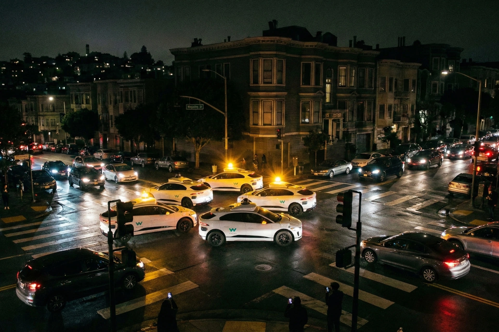

# Head Editor

**id**: 20251222-waymo-driverless-taxis-were-paralyzed
**title**: San Francisco blackout paralyzes Waymo robotaxis and gridlocks city traffic
**description**: A massive power outage in San Francisco ground Waymo's robotaxi fleet to a halt, triggering an investigation by the CPUC. This incident highlights the far-reaching impact on autonomous vehicle resilience, smart city power infrastructure, and emerging insurance risks, while exploring the core challenges of commercializing robotaxis.
**keywords**: Waymo, autonomous driving, San Francisco blackout, Alphabet, robotaxi, smart cities, CPUC, PG&E, edge cases, industry analysis, risk management, smart infrastructure
**Source**: https://www.bbc.com/news/articles/c36zdxl41jro
**TAGs**: Robotaxi, Energy
**date**: 2025-12-22

---

# Hero Editor

	

		

			<h1>San Francisco blackout paralyzes Waymo robotaxis and gridlocks city traffic</h1>
			

				<time datetime="2025-12-22">2025-12-22</time>
				<ul class="tags">
					<li class="yolk">Robotaxi</li>
					<li class="yolk">Energy</li>
				</ul>
			

		

	

	

---

# Content Editor

	

		
A power outage in San Francisco over the weekend was more than just another infrastructure fail; it turned into a brutal reality check for Silicon Valley’s self-driving tech. The massive blackout didn't just leave parts of the city in the dark, it caused Alphabet’s Waymo robotaxis to collectively grind to a halt in the middle of the streets, making the traffic mess even worse. This whole situation has put Waymo in a PR crisis and sparked serious questions from regulators, experts, and the public about whether self-driving cars can actually handle real-world emergencies.

		
The California Public Utilities Commission (CPUC), which oversees autonomous vehicle services, confirmed it is stepping in to investigate exactly what happened.

		
The outage started when a fire broke out at a PG&E substation in San Francisco, cutting power to about a third of the city's residents.

		
At intersections where the traffic lights went dark, a large number of Waymo robotaxis simply froze up because they couldn't figure out how to navigate, which completely paralyzed traffic in those areas.

		

			
💡

			
The <strong>CPUC</strong> (California Public Utilities Commission) is the government agency responsible for regulating private utilities in California, which includes self-driving ride-share services.

			
What really sets them apart is their "power-first" approach. They advocate for a co-location model, which basically means setting up massive industrial hubs like data centers right next to dedicated renewable energy and storage sites. Doing it this way speeds up construction, takes the pressure off the existing power grid, and makes sure the energy supply is both reliable and affordable.

		

	

	

		<h2>Substation fire causes chaos on city streets</h2>
		
The whole thing started with a fire at a PG&E substation. According to PG&E, the fire did "major and widespread" damage to the equipment inside. Initially, about 40,000 customers lost power, but the utility company had to cut even more lines so the fire department could put out the flames safely. That ended up leaving about 130,000 customers in the dark.

		
As the city’s power grid went down, white Waymo Jaguar I-PACE robotaxis were seen with their hazard lights flashing, stuck right in the middle of intersections where the traffic lights were out. This just made the traffic mess from the blackout even worse.

		
Waymo later explained the technical reason why the cars froze up. Their self-driving system is designed to treat dead traffic lights as a four-way stop. While the cars can usually handle a four-way stop, the real issue was the "scale" of the blackout. Because so many lights went out across the city all at once, there was a "massive spike" in confirmation requests sent to the fleet support team. This safety-first confirmation mechanism got overwhelmed by the sheer volume of requests, so the cars chose to stay put to be absolutely safe.

		
Waymo also pointed out that despite the hiccups, their cars still "successfully navigated over 7,000 un-signaled intersections" on the day of the blackout, showing that the system still works in most cases.

		<h3 class="inside">Waymo’s response and promises</h3>
		
After the chaos on Saturday, Waymo acted fast. They did an internal review and made some tweaks, then got back on the road the next day. They promised to learn from what happened and are already making changes to their tech and internal processes. The company announced a software update that will give the self-driving system more context about regional blackouts so it can navigate "more decisively" in the future. They also said they’re improving their emergency protocols to handle large-scale city emergencies better.

		<h3 class="inside">Lessons learned from the blackout</h3>
		
It looks like Waymo is already turning this tough lesson into a more cautious game plan. Just a few days later, on December 25, Waymo proactively shut down its San Francisco service because of a flash flood warning from the National Weather Service. After the blackout crisis, Waymo has clearly shifted to a more conservative risk management strategy, preferring to stop service altogether rather than risk another public safety issue.

	

	

		<h2>Waymo’s traffic meltdown gives us plenty to think about</h2>
		
This blackout was basically a very expensive stress test. In the past, the market mostly judged Waymo, Tesla, or Cruise on how advanced their AI was. But this incident proves that the ability to handle "edge cases" is the real key to whether these companies can actually scale. In the future, the competition in the self-driving industry won’t just be about who drives the smoothest. It’ll be about whose system has the grit to keep working in extreme situations with no internet, no power, and no landmarks. This will likely shift the R&D focus from pure AI to more complex hardware backups and offline decision-making systems.

		<h3 class="inside">Energy stability is becoming the heart of digital transformation</h3>
		
The fact that a PG&E equipment failure could paralyze a high-tech robotaxi fleet really highlights why we need to invest in smart city infrastructure. If cities want to fully adopt self-driving tech, things like microgrids and independent power for traffic lights are going to become standard. This is going to create a lot of demand for energy management systems and storage equipment suppliers.

		<h3 class="inside">New types of insurance and risk assessment</h3>
		
When self-driving cars cause a traffic jam because of a systemic overload instead of a crash, who is actually responsible? Is it the software provider, the operator, or the utility company? This accident is going to push the insurance industry to redesign business interruption insurance specifically for autonomous fleets. It will also likely drive up compliance costs and insurance premiums for operators.

	

