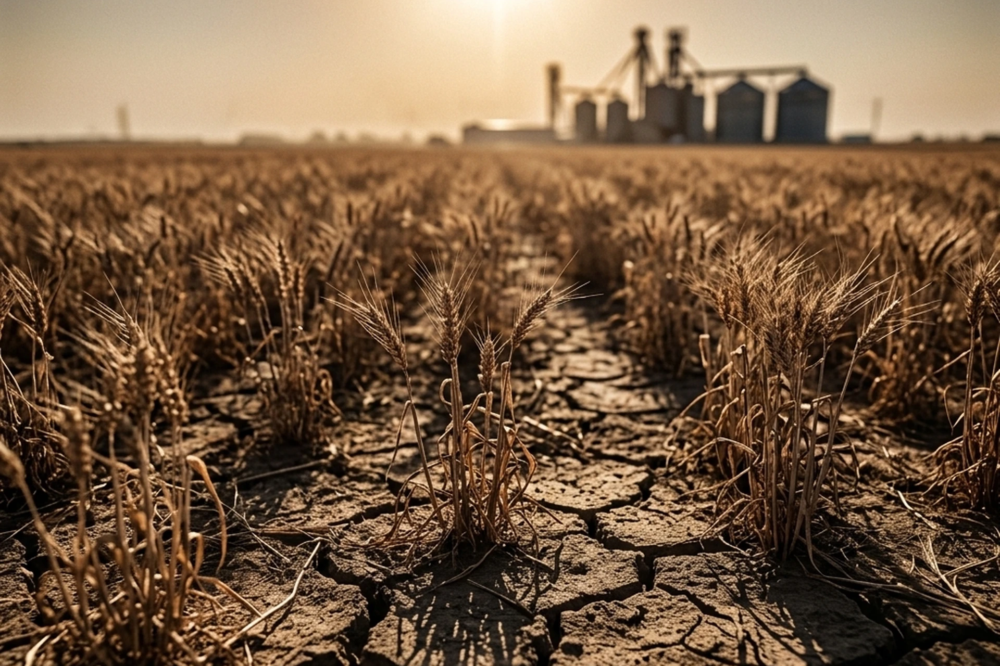

# Head Editor

**id**: 20260716-super-el-nino-climateflation
**title**: 2026 Super El Niño Triggers "Climateflation": How Extreme Weather is Reshaping Food Supply Chains and Investment Landscapes
**description**: The 2026 Super El Niño is threatening global agricultural supply chains, potentially triggering climateflation that could last until 2028. Investors should focus on corporate climate preparedness, seeking adaptation economy sectors with resilient supply chains and water management, while avoiding vulnerable, single-source dependent companies.
**keywords**: 2026 Super El Nino, Climateflation, Food Supply Chain, Agricultural Investment, Climate Preparedness, Adaptation Economy, ValueCafe
**TAGs**: Macro, Commodities, Investing
**date**: 2026-07-16

---

# Hero Editor

	

		

			<h1>2026 Super El Niño Triggers "Climateflation": How Extreme Weather is Reshaping Food Supply Chains and Investment Landscapes</h1>
			

				<time datetime="2026-07-16">2026-07-16</time>
				<ul class="tags">
					<li class="yolk">Macro</li>
					<li class="yolk">Commodities</li>
					<li class="yolk">Investing</li>
				</ul>
			

		

	

	

---

# Content Editor

	

		
Extreme weather events have recently dominated global news headlines. This is not simply a weather variable, but a severe economic and investment test. The ensuing crop yield reductions and logistical disruptions are brewing an inflationary pressure that cannot be ignored, and are also dictating the direction of global capital seeking safe havens.

		<ul>
			<li><strong>Core Event</strong>: The 2026 Super El Niño is approaching. Expected to be the strongest weather anomaly in decades and superimposing with global warming, it threatens a global agricultural supply chain crisis.</li>
			<li><strong>Impact Scope</strong>: Agricultural products and food supply chains will be hit across the board. Plunging yields in Indian wheat and rice, Indonesian palm oil, West African cocoa, and European corn and dairy products are causing concurrent spikes in fertilizer and logistics costs.</li>
			<li><strong>Key Takeaway</strong>: "Climateflation" is expected to extend to 2028, making corporate adaptability the new focus for investors. Investors should price in "climate preparedness," focusing on companies with supply chain resilience, water management, and climate adaptation technologies.</li>
		</ul>
	

	

		<h2>Super El Niño Strikes: Pushing Agriculture to the Brink of Collapse</h2>
		
The World Meteorological Organization (WMO) predicts a 60% chance of a Super El Niño occurring in the summer of 2026. With current global temperatures already at historical highs, this El Niño will have a powerful multiplier effect, pushing multiple key agricultural regions to their production limits and putting immense strain on the food supply chain.

		<h3 class="inside">Historical High Temperatures and Yield Reduction Alerts</h3>
		
Temperatures hitting record highs across various regions directly impact crop and livestock production. In Europe, recent extreme heat waves in France damaged up to a third of the local corn crop. In Italy, temperatures exceeding 40°C severely reduced dairy cows' appetites, causing milk production to drop by 10% and threatening the famous Parmigiano Reggiano supply chain. Dairy farmers even have to bear high electricity costs to run cooling equipment. Furthermore, India is facing drought threats, with rainfall in some areas dropping to half of previous levels, dealing a heavy blow to the harvests of staple crops like wheat and rice.

		<h3 class="inside">Marine Heatwaves and Fisheries Impact</h3>
		
Beyond the heat on land, marine ecosystems are similarly devastated. The world's oceans are experiencing massive heatwaves, with abnormal warming causing a drop in oxygen levels. Australia's coasts recently saw massive fish die-offs, and Chile has previously suffered extensive algal blooms triggered by warming waters, severely damaging the farmed salmon industry. These phenomena show that the impact of extreme weather on the food supply spans agriculture, fisheries, and livestock.

	

	

		<h2>"Polycrisis" Superposition: Why is the Supply Chain So Vulnerable?</h2>
		
The current global business environment is in a state of high uncertainty. Climate anomalies do not occur in isolation; they intertwine with other economic and geopolitical factors, forming a potent "polycrisis."

		<h3 class="inside">The Perfect Storm of Climate, Geopolitics, and Logistics</h3>
		
Geopolitical tensions and extreme weather have triggered a chain reaction. Ongoing conflicts in the Middle East continue to disrupt key shipping lanes like the Red Sea, leading to a sharp rise in trans-Pacific container freight rates. At the same time, export restrictions on vital fertilizers like urea and phosphorus are driving up agricultural input costs. Under these circumstances, farmers must simultaneously combat drought and heat while bearing the brunt of expensive fertilizer and fuel costs, severely compressing their profit margins and forcing them to reduce planting areas.

		<h3 class="inside">Historical Models Failing: The Blind Spots in Corporate Forecasting</h3>
		
Many food manufacturers and retailers still rely too heavily on past historical data when forecasting supply, demand, and costs. In today's era of normalized extreme weather, traditional forecasting models are no longer equipped to handle structural climate shocks. In the past, companies were accustomed to sourcing from single producing regions, assuming stable delivery times and prices. Faced with this Super El Niño, such inflexible supply chain models will struggle to function, leaving companies unable to swiftly pivot to other sources to fill gaps.

	

	

		<h2>The Transmission Mechanism of Climateflation</h2>
		
Fluctuations in agricultural production do not immediately reflect on supermarket price tags; there is a significant time lag. However, once prices begin to climb, the impact is often deeper and more enduring than the market anticipates.

		<h3 class="inside">The Deferred Price Effect Across Quarters</h3>
		
After a drought hits an agricultural region, it usually takes 4 to 8 months for the shock to reflect in the price tags of end-consumer food products. This is because major food companies generally have forward contracts or hold certain inventories, allowing them to temporarily absorb the pressure of rising raw material costs. As inventories are depleted and contracts expire, high agricultural prices will eventually be passed on to consumers, driving up the overall price level. Analysts expect the most impacted agricultural products could see a price premium of up to 40% in the coming quarters.

		<h3 class="inside">The Key Reason Goldman Sachs Predicts the Impact Will Last Until 2028</h3>
		
Research by Goldman Sachs indicates the Super El Niño could cause global food commodity prices to spike by 15.8%. Because different crops have varying planting and harvesting cycles, and weather impacts hemispheres at different times, this climate-driven food price shock cannot end in the short term. Goldman Sachs estimates that the related inflationary effects won't fully materialize until the second half of 2028, undoubtedly adding to the considerations and pressures on central banks when formulating interest rate cut policies.

	

	

		<h2>Investment Advice and Market View: Finding Winners in the "Adaptation Economy"</h2>
		
In the face of climateflation, market capital is realigning its allocation. While investors previously focused mostly on a company's ESG rating or carbon footprint, the market will shift away from simple "risk exposure" assessments toward a company's "climate preparedness" in extreme environments. Under the logic of value investing, companies that can build a sufficient margin of safety are the winners actively developing the adaptation economy.

		<h3 class="inside">Beneficiaries</h3>
		
Valuation standards are shifting; companies with agricultural technology and water management will emerge victorious in climate challenges. Water technology and infrastructure provider Xylem (NYSE: XYL) is clearly benefiting from growing demand for water recycling and distribution across sectors. In addition, agricultural tech company Corteva (NYSE: CTVA) can assist farmers in weathering climate crises by developing drought-resistant seeds and next-generation crop protection, bringing tangible revenue growth. These solution-providing enterprises possess formidable competitiveness and investment value in the upcoming wave of the adaptation economy.

		<h3 class="inside">Casualties</h3>
		
Companies lacking supply chain elasticity and heavily reliant on single origins will face severe challenges. For example, chocolate manufacturer Hershey (NYSE: HSY) heavily depends on West African cocoa beans; once the producing region suffers a climate shock, its profits are bound to be severely compressed. Traditional food processors like this, unable to quickly diversify origin risks, appear particularly fragile under the test of climate change. Investors should carefully evaluate their long-term operational risks.

	

	

		<h2>Conclusion</h2>
		
The normalization of extreme weather has become a new reality that global markets must face head-on. The shock brought by the 2026 Super El Niño will not only push up agricultural prices but also deeply implant "climateflation" into future economic expectations. In such an environment, value investors should avoid sectors with fragile supply chains that heavily rely on single resources, and instead allocate to assets with climate resilience and adaptation technologies. By doing so, they can seek stable returns in an increasingly volatile market and build a sufficient margin of safety for their portfolios.

	

