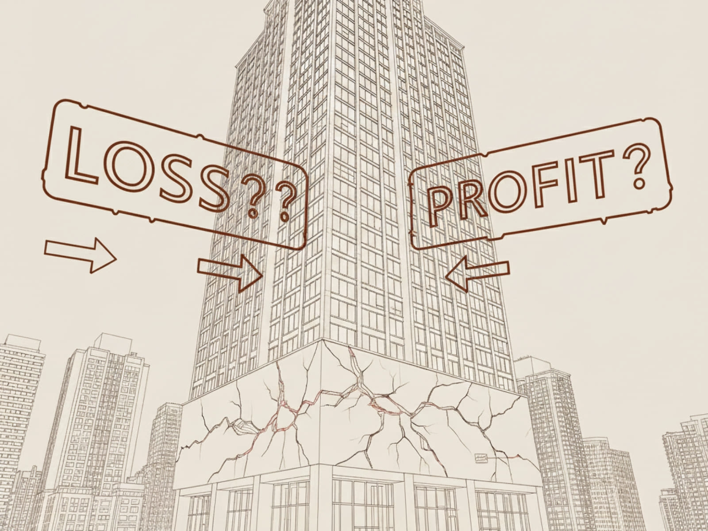

# Head Editor

**id**: non-operating-income
**title**: Is 'Non-Operating Income' a bonus or a trap? It is actually part of your profit quality check.
**description**: 'Non-operating income' can make a company’s net profit look better than it really is, but is it a real opportunity or a trap? Start by looking at the 'quality of earnings.' You need to separate one-time gains from sustainable profits and use the hard data in the financial reports to make better investment calls.
**keywords**: Non-operating income, quality of earnings, non-operating income financial statements, one-time gains, evaluating earnings quality, non-operating income traps, non-operating revenue.
**list-summary**: Non-operating income isn't just a random number; it can also be an integrated part of the business model.
**name**: Is 《 Non-Operating Income 》 a bonus or a trap? The truth is, non-operating income is also part of a company's 'quality of earnings'.

---

# Hero Editor

	

		

			<h1>Is 'Non-Operating Income' a bonus or a trap? It is actually part of your profit quality check.</h1>
			
Non-operating items are a bit of a wildcard. They’re kind of like your family members: you can’t really control them, but they definitely have an impact on you. When they do something great or something terrible, it’s absolutely going to change how people look at you.

		

	

	

---

# Content Editor

	

		
When you're looking at a financial statement and see that the "pre-tax income" is way higher than the <stong>operating profit</stong>, do you get excited or does it make you a little nervous?

		
<stong>Pre-tax income</stong> is basically just <stong>operating profit</stong> plus <stong>non-operating income</stong>. Now, companies often use non-operating income to fluff up their numbers and mislead investors, but that doesn't necessarily mean it's a bad thing every time.

		
We’re going to dig into what non-operating income actually is. Depending on the situation and where that money is coming from, it can mean completely different things for the business.

	

	

		<h2>What is non-operating income?</h2>
		
Imagine you run a breakfast joint. The money you make every day selling soy milk and omelets is your "operating income." That is your core business and how you stay afloat.

		
Then one day, you decide to sell an old but still working oven to your neighbor for a little extra cash. That money didn't come from your "main business," so it’s what we call "non-operating income." It’s a nice bonus, but it has nothing to do with whether you’ll keep selling breakfast tomorrow.

		

			

				
Pre-tax income = Operating profit + Non-operating income

			

		

		
For a company, non-operating income includes things like selling off assets, investment gains, or profits from subsidiaries. On the other hand, "operating profit" is just the tally of what the company makes from its core business.

		
⚠️ Just a quick heads-up: the official term is usually "non-operating income and expenses," which covers both gains and losses. I personally just use "non-operating income" and treat losses as negative numbers.

		<h3 class="inside">Common types of non-operating income</h3>
		
In a financial report, you’ll see several different items under "non-operating income and expenses." Here are a few common ones.

		<ul>
			<li><strong>Gains or losses from selling assets</strong>: This is money made from selling land, factories, or equipment. Usually, these are just one-time events.</li>
			<li><strong>Interest income</strong>: This is basically the interest a company earns just by having cash sitting in the bank.</li>
			<li><strong>Dividend income</strong>: Money the company gets from owning shares in other businesses.</li>
			<li><strong>Currency gains or losses</strong>: Profits or losses caused by swings in exchange rates. This can be a huge deal for companies with a lot of international business.</li>
			<li><strong>Equity method earnings</strong>: This is a bit more complex. If a company owns a large, long-term stake in another business (like a subsidiary), it records its share of that business's profits or losses. This is often the key to figuring out if the non-operating income is actually "sustainable" or just a one-off.</li>
		</ul>
	

	

		<h2>Two key factors for judging earnings quality</h2>
		
"Will this money still be there next year?"

		
When you see non-operating income, don’t jump for joy just yet. You need to figure out the quality and stability of that income to see if it’s just a one-time windfall or a reliable cash cow.

		<h3 class="inside">Be wary of one-time gains</h3>
		
One-time gains are like that breakfast shop selling its old oven; it’s a random event that doesn't happen every day. For a company, this usually means things like selling off a factory, winning a lawsuit, or getting a government grant. Even if the profit looks good on paper, you need to stay sharp for a few reasons.

		
Massive one-time gains make net income and EPS look amazing, giving you the illusion that the company is suddenly taking off.

		
It can act as a smokescreen. Some managers sell off assets to fluff up the financials and hide the fact that the core business is actually struggling.

		
It’s a major valuation trap. If you calculate the P/E ratio using an inflated EPS, the stock will look "dirt cheap," and you’ll walk right into a trap.

		
Warren Buffett prefers companies with very little non-operating income. Focusing on the core business is usually the secret to winning in the long run.

		<h3 class="inside">Sustainable income is where the real value is</h3>
		
To be fair, not all non-operating income is a red flag. Some of it is steady and reliable, and it can even be a core part of how the company operates.

		
The best example is "equity method earnings," which we mentioned earlier. Basically, if Company A owns a big chunk of Company B (like a subsidiary), Company A gets to count its share of Company B’s profits as its own.

		
This isn’t about a one-off sale; it’s a long-term strategic investment. As long as the subsidiary is healthy, it provides a steady stream of cash to the parent company.

	

	

		<h2>Looking at the quality of non-operating income</h2>
		
Non-operating income isn’t just a bunch of random numbers; it can be a vital part of a business model. If you find a company with reliable, recurring non-operating income, you’ve essentially found a second engine driving the business forward.

		
If you’ve been following along with my other posts, you’ve probably noticed a theme: the quality of earnings matters way more than the quantity. Sure, the numbers on the report affect the valuation and P/E ratio, but if you’re in this for the long haul, you want high-quality earnings that ensure steady, sustainable growth.

	

