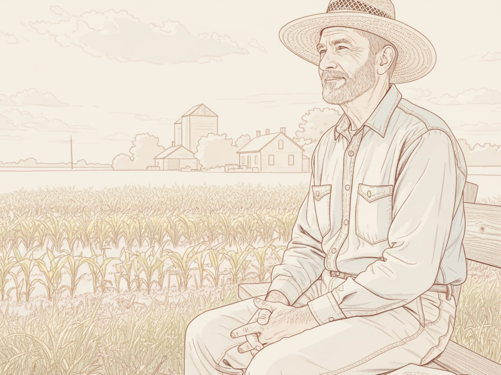

# Head Editor

**id**: patience-of-value-investing
**title**: Is 'Patience' hard in investing? Try thinking like a business owner.
**description**: Feeling anxious when stocks take a hit? Drawing from Warren Buffett’s farm story, you can develop the mindset of a farm owner who holds for the long haul. The kind of value investing that actually lets you sleep at night is basically doing nothing at all.
**keywords**: Value investing, long-term holding, building an investment mindset, overcoming investment anxiety, dealing with market dips, Buffett’s farm story, zen investing.
**list-summary**: Most people live like anxious 'stock-price tenants' rather than calm-and-steady 'business owners.' Why does it seem to make perfect sense to calmly hold a farm for decades, but people can't apply that same mindset to the stocks they own?
**name**: Is having 《 Patience 》 in stock investing really that hard? Try thinking of yourself as a business owner.

---

# Hero Editor

	

		

			<h1>Is 'Patience' hard in investing? Try thinking like a business owner.</h1>
			
The single most important action you can take is making the right purchase at the start. After that, it’s decades of just sitting tight.

			
When you plant a seed, you don't expect it to grow into a giant tree overnight. If you're running a food cart, you don't expect it to turn into a massive franchise by tomorrow morning. You know it takes time and patience. By the time you start seeing real results, you'll realize that those small daily actions have just become a natural habit.

			
Investing works the exact same way. You pick a great company that’s undervalued, buy it, and then you just let it sit. Don’t expect to get rich tomorrow; it’s going to take its time to bring you those returns. All you really need to do is check in once in a while to see if there’s any big news or to make sure their latest quarterly earnings are still on track.

		

	

	

---

# Content Editor

	

		
Back in 1986, Warren Buffett bought a farm in Omaha, even though he openly admitted he didn’t know the first thing about farming. His son was the one who loved it. He gave his dad the rundown on how much corn and soy they could grow and what the operating costs would look like.

		
Buffett did some quick math and figured he’d see about a 10% return. He knew that over the long run, the farm would get more productive and crop prices would go up. Once the deal was done, he never bothered looking for a daily price tag on the land or stressed out about whether the neighbor’s property value was fluctuating.

		
Sure, some years were bad for crops, but it didn't really matter. As long as you hold on for the long haul, you'll have great years too, and there was never any pressure to sell the asset.

		
This brings up a good point: why is it so natural to stay calm while holding a farm for decades, but so hard to have that same mindset with a stock?

		
In the investing world, most people act like "anxious renters" of a stock price instead of "confident owners" of a business. We care way more about the numbers flashing on a screen than the actual value of the company itself. This is the first big hurdle to building a solid value investing mindset, and it’s the part that people overlook the most.

	

	

		<h2>Why is it so hard to be patient?</h2>
		
When we see ourselves as just "renters" of a stock price, we’re basically handing over control of our emotions to the market’s mood swings.

		
You’ll find yourself constantly trying to guess the market's mood. Is it up or down today? What’s the news saying? What are the experts predicting now? With that mindset, it’s only natural to feel fear and panic when stock prices take a hit.

		
But there’s another way to go about it.

		
You can choose to be a "business owner," just like the patient farmer we talked about. Let's look at how these two different mindsets react to the same market and see how the results turn out.

		

			

				

					<h5>Anxious trader (stock renter)</h5>
					

					

						

							

								<i class="bi-caret-right-fill"></i> <strong>Core focus</strong>
							

							
Daily market price swings.

						

						

							

								<i class="bi-caret-right-fill"></i> <strong>Time horizon</strong>
							

							
Minutes, days, or months.

						

						

							

								<i class="bi-caret-right-fill"></i> <strong>Where the info comes from</strong>
							

							
Financial news, expert predictions, and market noise.

						

						

							

								<i class="bi-caret-right-fill"></i> <strong>Where the anxiety comes from</strong>
							

							
"Can I time the market?" (FOMO and fear).

						

						

							

								<i class="bi-caret-right-fill"></i> <strong>Take on market crashes</strong>
							

							
A terrifying crisis that demands immediate action (Sell!).

						

						

							

								<i class="bi-caret-right-fill"></i> <strong>What "taking action" really means</strong>
							

							
Constant buying and selling.

						

						

							

								<i class="bi-caret-right-fill"></i> <strong>The end goal</strong>
							

							
Trying to outsmart the market for short-term profits.

						

					

				

			

			

				

					<h5>Patient farmer (business owner)</h5>
					

					

						

							

								<i class="bi-caret-right-fill"></i> <strong>Core focus</strong>
							

							
The long-term productivity and profitability of the business.

						

						

							

								<i class="bi-caret-right-fill"></i> <strong>Time horizon</strong>
							

							
Years, decades, or even a lifetime.

						

						

							

								<i class="bi-caret-right-fill"></i> <strong>Where the info comes from</strong>
							

							
Annual reports, industry analysis, and business fundamentals.

						

						

							

								<i class="bi-caret-right-fill"></i> <strong>Where the anxiety comes from</strong>
							

							
"Is the core productivity of this business still going strong?"

						

						

							

								<i class="bi-caret-right-fill"></i> <strong>Take on market crashes</strong>
							

							
A "bad harvest year" or a chance to buy more "land" at a discount.

						

						

							

								<i class="bi-caret-right-fill"></i> <strong>What "taking action" really means</strong>
							

							
The initial decision to buy followed by a deliberate, patient hold.

						

						

							

								<i class="bi-caret-right-fill"></i> <strong>The end goal</strong>
							

							
Partnering with a great company and letting wealth compound over time.

						

					

				

			

		

		
If you find yourself constantly struggling on that left side, don’t blame yourself for the anxiety. It really just comes down to your perspective. You don’t need more willpower; you just need a whole new operating system.

	

	

		<h2>Building a long-term business owner mindset</h2>
		
Moving from a short-term to a long-term mindset doesn't take special talent; it just takes a shift in how you see things. Warren Buffett’s farm story isn't just an inspiration, it’s a perfect roadmap for understanding what it truly means to think like a long-term business owner.

		<h3 class="inside">Shifting focus from daily quotes to annual output</h3>
		
A trader wakes up every morning and immediately checks, "What's the stock price today?" Meanwhile, a farmer occasionally thinks, "How's the harvest looking this year?" That tiny difference in focus leads to completely different emotions and results.

		
Even though Buffett didn't know the first thing about farming, he estimated that the land would bring in about a 10% annual return. His decision was based on the asset's earning power, essentially how much cash that "land" could generate for him, rather than what he could sell it for later.

		
The stock market provides a price that changes every single second, and that’s exactly where all that investing anxiety comes from. Farmers stay calm because nobody shows up every day to give them a quote on their land, so they can focus on what actually matters: the land's productivity. That is the secret to long-term value investing. Your focus should be on the company’s annual reports, not the flashing numbers on your brokerage app.

		<h3 class="inside">Reframing a market crash as a bad harvest year</h3>
		
Traders view risk as a drop in price, while farmers see risk as a drop in production. The first leads to panic, while the second is just seen as part of the business. In investing, you’re bound to hit a "bad harvest" or a disappointing price every now and then. A 50% market crash looks like the end of the world to a trader, but to a farmer, it’s just one bad year.

		
As long as the land is still fertile (meaning the company's fundamentals are still strong), one bad year isn't a big deal. You shouldn't panic and sell your land for cheap. Instead, you wait patiently for the next good season. In fact, if your neighbor panics and tries to dump their farm because of a bad harvest, you can step in and buy more fertile land at a discount.

		<h3 class="inside">Moving from frequent trading to doing nothing</h3>
		
For a trader, buying and selling is a daily necessity. For a farmer, the most important action is simply making that first right purchase. After that, it’s all about decades of "doing nothing."

		
Buffett mentioned that since he bought his farm, he’s only visited it twice. Almost all of his massive profits came from that single decision in 1986 and the long years of patient waiting that followed. Real investing returns come from the long-term compounding of what you don't do. Once you’ve done your homework and bought a piece of a great company, 99% of the hard work is over. The remaining 1% is just fighting the urge to do something and letting that value snowball over time.

	

	

		<h2>Be a business owner, not a price chaser</h2>
		
When you truly start seeing yourself as a business owner or a farmer, rather than a renter who's obsessed with the price, you'll feel a massive shift. You’ll stop worrying about short-term price gaps and start focusing on long-term value.

		
The real returns in investing come from the decision to not do anything.

		
When you pick the right company, the most important thing left to do is give it time and patience. Let that value grow, and eventually, you’ll reap a huge reward, along with the freedom of never having to feel anxious again.

	

