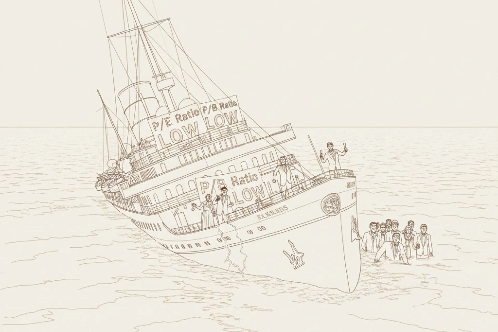

# Head Editor

**id**: value-trap
**title**: A Value Trap' could be the most expensive lesson you learn! Watch out for these 3 red flags.
**description**: Feeling anxious when stocks take a hit? Drawing from Warren Buffett’s farm story, you can develop the mindset of a farm owner who holds for the long haul. The kind of value investing that actually lets you sleep at night is basically doing nothing at all.
**keywords**: Value investing, long-term holding, building an investment mindset, overcoming investment anxiety, dealing with market dips, Buffett’s farm story, zen investing.
**list-summary**: You think you're buying a cheap stock, but you might actually be buying a business that is slowly dying.
**name**: A 《 Value Trap 》 might be the most expensive lesson you'll ever learn! Watch out for these 3 big red flags.

---

# Hero Editor

	

		

			<h1>A Value Trap' could be the most expensive lesson you learn! Watch out for these 3 red flags.</h1>
			
You’re walking down a crowded street and spot a dollar bill on the sidewalk. You think to yourself, "How did everyone else miss this?" You lean down to grab it, but as soon as you pick it up, you realize it’s just play money. The stock market is a lot like that. You read the financial reports, run your valuation formulas, and get all excited because you think you found a stock that the market has completely undervalued. But after you buy in, you realize there was a perfectly good reason the price was low in the first place.

			
Most of the time, the market is smarter than we give it credit for. A low price usually just means that’s all the stock is actually worth. The market has already seen right through it.

		

	

	

---

# Content Editor

	

		
"Rule number one: Never lose money. Rule number two: Never forget rule number one." That’s the classic Warren Buffett quote.

		
Even the best, like Warren Buffett, have messed up. But that one big mistake ended up being one of the most valuable lessons of his life.

		
A long time ago, he came across a textile mill called Berkshire Hathaway while digging through some financial reports. On paper, it looked like a total steal. The stock was trading way below the company’s working capital. He figured that even if he just sold off the old textile machines, he'd still come out ahead. He thought, "There's no way I can lose money on this."

		
But he realized pretty quickly that he didn't buy a bargain; he bought a business that was slowly dying. The U.S. textile industry was in a downward spiral that no one could stop. No matter how hard the management worked or how much cash they pumped in, it was like trying to fill a bathtub with a huge hole in the bottom. And those machines he thought were worth so much? They were actually worth next to nothing.

		
That textile mill was an expensive lesson, but it taught him something crucial: It’s way better to buy a great company at a fair price than a mediocre company at a "cheap" price.

		
This story is a total classic, and it highlights one of the biggest blind spots in value investing. As a value investor, you have to understand the reality of a "value trap."

	

	

		<h2>What is a value trap? Why cheap doesn't always mean it's a steal</h2>
		
Simply put, a value trap happens when you think you’re getting a bargain, but you’ve actually miscalculated the company's real worth. Instead of bouncing back after you buy in, the stock price just keeps sliding.

		
A lot of value investors fall for this when they're hunting for deals. They see a low P/E ratio or a low price-to-book ratio and think they've found a winner, but it's often a trap.

		
The big mistake here is thinking the market is wrong and you're right. But the truth is, that low price usually isn't just some temporary market panic or a mistake. It’s actually a fair price for a company that is expected to keep declining.

		
At its core, a value trap is a business where the fundamentals and future earnings are steadily rotting away. The company’s intrinsic value is disappearing. Maybe the business was a powerhouse in the past, so you think you’ve found a gem, but in reality, you’re just buying a ticket on a sinking ship that isn't built to survive what’s coming next.

	

	

		<h2>How to systematically avoid value traps: Three red flags to watch for</h2>
		
Avoiding value traps isn't just a gut feeling; you need a solid system. Think of it like a seasoned captain checking the hull, the engine, and the charts before setting sail. You have to be just as strict with a company before putting your hard-earned money on the line.

		<h3 class="inside">Flag 1 : A crumbling economic moat</h3>
		
I like to call a company's lasting edge its "economic moat." It could be a powerful brand, a special patent, or a cost advantage that's hard to beat. This moat is what keeps competitors away and protects profits. But you can't just look at how wide the moat is right now; you have to see if it’s getting wider or narrower. If a company is losing market share, that's usually the first sign the moat is shrinking. It often means a better competitor has arrived or the technology has changed.

		<h3 class="inside">Flag 2 : Key financial metrics that keep getting worse</h3>
		
If the moat is the story, the financials are the proof. Numbers don't lie; they’re like an X-ray of the business. You have to be a detective with the financial reports. Don't just look at one quarter; check the trend over three to five years. A little dip here and there is fine, but if several metrics are consistently trending down, that’s a massive sign you’re looking at a value trap.

		
When you see a stock that looks cheap, make sure to check if these indicators are heading south.

		<ul>
			<li><strong>Falling revenue and margins</strong>: This is the most direct warning. If sales are flat or dropping while profit margins are shrinking, it means the company is losing its ability to set prices or its costs are out of control.</li>
			<li><strong>High and rising debt</strong>: Too much debt makes a company way too risky. A lot of businesses use debt to make their ROE look better when times are good, but once the market turns, high interest payments can eat up all the profits and even lead to bankruptcy.</li>
			<li><strong>Poor cash flow</strong>: Cash is the oxygen for a business. You need to check if the cash coming from operations is consistently negative or way lower than the profit they’re reporting on paper. If they aren't actually collecting the cash they claim to be making, those earnings are basically a house of cards.</li>
		</ul>
		<h3 class="inside">Flag 3 : An industry in structural decline</h3>
		
Sometimes a company is run well and has a great team, but the entire "industry ship" is going down. This kind of permanent decline, usually caused by new tech or shifting habits, is one of the hardest traps to escape.

		
In these industries, even the top players will probably see their profits shrink year after year. The market usually sees this coming and prices the stocks really low. If you buy in just because the P/E ratio is low, you aren’t investing in value; you’re just betting on a piece of history that’s fading away.

	

	

		<h2>Stay within your circle of competence</h2>
		
Build your circle of competence and keep a close eye on your "golden castle." Focus on the company’s long-term staying power instead of getting distracted by short-term price moves.

		
Real success in investing isn't about finding a "secret" stock that will make you rich overnight. It comes from a much simpler kind of wisdom: systematically avoiding the traps that can wipe you out.

		
At the end of the day, a true margin of safety isn't just a cheap price tag. It comes from deeply understanding the business. That right there is your circle of competence.

	

